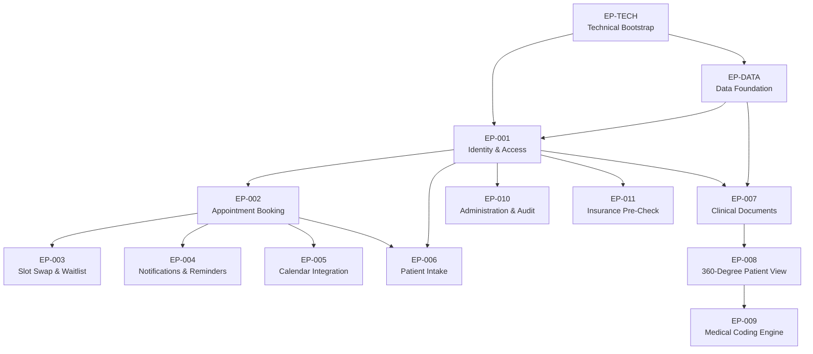

# Epic Backlog

## Document Information

| Field | Value |
|-------|-------|
| **Project** | Unified Patient Access & Clinical Intelligence Platform |
| **Version** | 1.0 |
| **Status** | Draft |
| **Source** | spec.md, design.md, model.md |
| **Phase** | Phase 1 |

---

## Epic Summary

| Epic ID | Title | Priority | Business Value | Dependencies | Est. Stories |
|---------|-------|----------|---------------|--------------|--------------|
| EP-TECH | Technical Bootstrap | Critical | Foundation | None | 6–8 |
| EP-DATA | Data Foundation | Critical | Foundation | EP-TECH | 4–6 |
| EP-001 | Identity & Access Management | Critical | Core Access | EP-TECH, EP-DATA | 6–8 |
| EP-002 | Appointment Booking | Critical | Primary Revenue | EP-001 | 8–10 |
| EP-003 | Preferred Slot Swap & Waitlist | High | Differentiation | EP-002 | 4–5 |
| EP-004 | Notifications & Reminders | High | Retention | EP-002 | 5–7 |
| EP-005 | Calendar Integration | Medium | Convenience | EP-002 | 3–4 |
| EP-006 | Patient Intake | High | Efficiency | EP-001, EP-002 | 5–7 |
| EP-007 | Clinical Document Management | High | Clinical Value | EP-001, EP-DATA | 4–6 |
| EP-008 | 360-Degree Patient View | Critical | Core Differentiator | EP-007 | 5–7 |
| EP-009 | Medical Coding Engine | High | Clinical Accuracy | EP-008 | 4–5 |
| EP-010 | Administration & Audit | High | Compliance | EP-001 | 5–6 |
| EP-011 | Insurance Pre-Check | Medium | Operational | EP-001 | 2–3 |

---

## Epic Dependency Graph

---

## Epic Details

### EP-TECH: Technical Bootstrap

| Field | Value |
|-------|-------|
| **ID** | EP-TECH |
| **Title** | Technical Bootstrap |
| **Priority** | Critical |
| **Business Value** | Foundation — enables all subsequent feature development |
| **Dependencies** | None |
| **Estimated Stories** | 6–8 |

**Description:**

Establish the foundational project structure, development environment, CI/CD pipeline, and architectural patterns. This epic creates the "golden path" for all subsequent development, ensuring consistent patterns, automated quality gates, and deployment infrastructure.

**Scope:**

- .NET 8 solution scaffolding with Clean Architecture layers (Api, Application, Domain, Infrastructure)
- Angular 17+ project setup with standalone components, routing, and core module
- Python FastAPI AI service project structure
- Docker Compose for local development environment
- GitHub Actions CI pipeline (build, test, lint)
- Development environment configuration (appsettings, environment variables)
- Shared infrastructure: error handling middleware, logging (Serilog), health checks
- API documentation setup (Swagger/OpenAPI)
- SignalR hub infrastructure

**Mapped Requirements:**

| Requirement ID | Description |
|----------------|-------------|
| TR-001 | Angular 17+ with standalone components |
| TR-008 | .NET 8 Web API |
| TR-009 | Clean Architecture (4-layer) |
| TR-010 | MediatR CQRS |
| TR-014 | FluentValidation |
| TR-019 | Serilog structured logging |
| TR-020 | Swagger/OpenAPI |
| TR-021 | ASP.NET Health Checks |
| TR-029 | RESTful with JSON |
| TR-030 | SignalR real-time |
| TR-032 | GitHub Actions CI/CD |
| TR-033 | Docker (dev environment) |
| TR-034 | Environment configuration |
| ADR-001 | Modular Monolith |
| ADR-003 | Python Sidecar for AI |

**Acceptance Criteria:**

- Solution builds and runs locally with single `docker-compose up` command
- CI pipeline passes on all branches (build + test)
- API serves Swagger documentation at `/swagger`
- Health check endpoint returns healthy status
- Serilog produces structured JSON logs with correlation IDs
- Angular app loads and displays a shell layout
- Python AI service starts and responds to health check

---

### EP-DATA: Data Foundation

| Field | Value |
|-------|-------|
| **ID** | EP-DATA |
| **Title** | Data Foundation |
| **Priority** | Critical |
| **Business Value** | Foundation — enables all data-dependent features |
| **Dependencies** | EP-TECH |
| **Estimated Stories** | 4–6 |

**Description:**

Establish the database schema, ORM configuration, migration pipeline, caching infrastructure, and data access patterns. This epic ensures HIPAA-compliant data storage, audit trail infrastructure, and Redis caching are available for all features.

**Scope:**

- PostgreSQL database provisioning (Neon/Supabase free tier)
- EF Core DbContext, entity configurations, and base entity patterns
- Initial migration with core schema (User, PatientProfile, Provider, AuditLog)
- Upstash Redis integration for caching and session management
- Audit log infrastructure (append-only table, hash chain, DB triggers)
- Repository pattern implementation
- Connection pooling and configuration
- Seed data scripts (providers, insurance records, appointment slots)

**Mapped Requirements:**

| Requirement ID | Description |
|----------------|-------------|
| TR-011 | Entity Framework Core 8 |
| TR-022 | PostgreSQL 16 |
| TR-023 | Upstash Redis |
| TR-024 | Neon/Supabase free tier |
| TR-025 | EF Core Migrations |
| TR-026 | Npgsql connection pooling |
| DR-001–DR-015 | All entity definitions |
| DR-016 | Append-only audit logs |
| DR-017 | Soft-delete pattern |
| DR-020 | UTC timestamps |
| NFR-008 | PostgreSQL for structured data |
| NFR-009 | Upstash Redis for caching |
| NFR-019 | Database connection pooling |
| ADR-006 | Append-only audit log with hash chain |

**Acceptance Criteria:**

- Migrations create all core tables in PostgreSQL
- Audit log table has triggers preventing UPDATE/DELETE
- Redis connection established with session TTL of 15 minutes
- Seed data populates providers, dummy insurance records, and time slots
- Repository pattern supports CRUD operations with audit logging
- All timestamps stored in UTC

---

### EP-001: Identity & Access Management

| Field | Value |
|-------|-------|
| **ID** | EP-001 |
| **Title** | Identity & Access Management |
| **Priority** | Critical |
| **Business Value** | Core Access — all features require authenticated users with proper authorization |
| **Dependencies** | EP-TECH, EP-DATA |
| **Estimated Stories** | 6–8 |

**Description:**

Implement user authentication, authorization, session management, and role-based access control. This epic covers patient self-registration, admin-managed staff accounts, JWT-based auth with Redis session validation, and the Angular auth integration (guards, interceptors).

**Scope:**

- ASP.NET Identity configuration with PostgreSQL store
- Patient self-registration (email, name, phone, password)
- Login with JWT (30-min) + Refresh Token (7-day rotation)
- Redis session validation per request (15-min inactivity timeout)
- Role-based authorization policies (Patient, Staff, Admin)
- Account lockout after 5 failed attempts (30-min lock)
- Password policy enforcement (min 12 chars, complexity)
- Angular auth module: login/register pages, JWT interceptor, route guards
- Logout and session termination

**Mapped Requirements:**

| Requirement ID | Description |
|----------------|-------------|
| FR-001 | Patient self-registration |
| FR-002 | Admin creates Staff/Admin accounts |
| FR-003 | Role-based access control |
| FR-004 | 15-minute session timeout |
| FR-005 | Secure authentication with encrypted credentials |
| TR-012 | ASP.NET Identity + JWT |
| TR-013 | Policy-based authorization |
| NFR-011 | TLS 1.2+ encryption |
| NFR-013 | 15-minute session timeout |
| NFR-014 | Password policy (12 chars, complexity) |
| NFR-016 | 5-attempt lockout |
| ADR-005 | JWT with Redis session validation |

**Acceptance Criteria:**

- Patients can self-register and login
- JWT tokens expire after 30 minutes; refresh tokens rotate after use
- Sessions terminate after 15 minutes of inactivity
- Staff/Admin accounts can only be created by Admin users
- 5 failed login attempts trigger 30-minute lockout
- Passwords enforce minimum 12 characters with complexity rules
- Angular guards redirect unauthenticated users to login
- All auth actions logged in audit trail

---

### EP-002: Appointment Booking

| Field | Value |
|-------|-------|
| **ID** | EP-002 |
| **Title** | Appointment Booking |
| **Priority** | Critical |
| **Business Value** | Primary Revenue — core scheduling capability directly impacts facility utilization and patient satisfaction |
| **Dependencies** | EP-001 |
| **Estimated Stories** | 8–10 |

**Description:**

Implement the complete appointment booking lifecycle including slot search, patient self-booking, staff-assisted booking, walk-in registration, same-day queue management, arrival marking, and PDF confirmation generation. This epic delivers the primary business capability of the platform.

**Scope:**

- Provider schedule and slot management (admin/backend seeding)
- Slot availability search by provider, date, time (with Redis caching)
- Patient appointment booking with slot reservation
- Staff booking on behalf of patients
- Walk-in registration by staff (with optional account creation)
- Same-day queue management interface (staff)
- Mark patient as "Arrived" (staff)
- Patient self-check-in prevention (authorization enforcement)
- Appointment confirmation PDF generation (QuestPDF)
- Email delivery of confirmation PDF
- Appointment status management (Booked → Arrived → Completed / Cancelled / NoShow)
- SignalR real-time slot availability updates

**Mapped Requirements:**

| Requirement ID | Description |
|----------------|-------------|
| FR-006 | Search available slots |
| FR-007 | Patient books slot |
| FR-008 | Staff books on behalf |
| FR-009 | Walk-in booking with optional account |
| FR-010 | Same-day queue management |
| FR-011 | Mark patient as "Arrived" |
| FR-012 | Prevent patient self-check-in |
| FR-013 | PDF confirmation via email |
| TR-015 | Hangfire background jobs |
| TR-016 | QuestPDF |
| TR-017 | MailKit email delivery |
| TR-030 | SignalR real-time updates |
| NFR-002 | Slot search < 500ms (p95) |
| NFR-020 | Cache hit ratio > 80% |
| UC-001 | Patient books appointment |
| UC-002 | Staff books for patient |
| UC-003 | Staff registers walk-in |
| UC-014 | Staff marks arrived |
| ADR-007 | QuestPDF for document generation |
| ADR-008 | Hangfire for background jobs |

**Acceptance Criteria:**

- Patients can search and book available appointment slots
- Staff can book appointments on behalf of patients
- Staff can register walk-ins and optionally create accounts
- Staff can manage same-day queue and mark patients as "Arrived"
- Patients cannot mark themselves as arrived or self-check-in
- Booking generates and emails a PDF confirmation
- Slot availability updates in real-time via SignalR
- Slot search responds in < 500ms (p95) with caching

---

### EP-003: Preferred Slot Swap & Waitlist

| Field | Value |
|-------|-------|
| **ID** | EP-003 |
| **Title** | Preferred Slot Swap & Waitlist |
| **Priority** | High |
| **Business Value** | Differentiation — unique feature reducing cancellations and improving patient satisfaction |
| **Dependencies** | EP-002 |
| **Estimated Stories** | 4–5 |

**Description:**

Implement the dynamic preferred slot swap mechanism where patients can register interest in an unavailable slot while keeping their confirmed booking. The system monitors slot availability and automatically performs the swap when the preferred slot opens.

**Scope:**

- Preferred slot selection during booking flow (UI + API)
- PreferredSlotPreference entity and state management
- Recurring Hangfire job to monitor slot availability
- Automatic swap logic (atomic transaction: move appointment, release original, update preference)
- Multi-patient conflict resolution (earliest registrant wins)
- Patient notification on swap execution (SMS + Email)
- Preference state machine (Pending → Swapped / Expired / Cancelled)

**Mapped Requirements:**

| Requirement ID | Description |
|----------------|-------------|
| FR-014 | Select preferred unavailable slot |
| FR-015 | Monitor and auto-swap |
| FR-016 | Release original slot on swap |
| FR-017 | Notify patient on swap |
| UC-004 | Preferred slot swap execution |

**Acceptance Criteria:**

- Patients can select a preferred unavailable slot during booking
- System monitors and automatically swaps when preferred slot becomes available
- Original slot is released back to available pool upon swap
- Patient receives SMS and email notification of the swap
- When multiple patients prefer the same slot, earliest registrant wins
- Preference expires if appointment time passes without swap

---

### EP-004: Notifications & Reminders

| Field | Value |
|-------|-------|
| **ID** | EP-004 |
| **Title** | Notifications & Reminders |
| **Priority** | High |
| **Business Value** | Retention — reduces no-show rate (15% baseline) through smart, timely reminders |
| **Dependencies** | EP-002 |
| **Estimated Stories** | 5–7 |

**Description:**

Implement multi-channel notification delivery (SMS and Email) with configurable reminder scheduling, no-show risk assessment, and delivery tracking. This epic directly targets the 15% no-show rate business problem.

**Scope:**

- Email notification service (MailKit + SMTP)
- SMS notification service (free-tier gateway)
- Configurable reminder scheduling (24h, 2h before appointment)
- Hangfire scheduled jobs for reminder delivery
- Rule-based no-show risk assessment engine
- Enhanced reminders for high-risk appointments
- Notification delivery tracking and retry logic
- Notification history and status reporting

**Mapped Requirements:**

| Requirement ID | Description |
|----------------|-------------|
| FR-018 | Automated SMS reminders |
| FR-019 | Automated email reminders |
| FR-020 | Rule-based no-show risk assessment |
| FR-021 | Configurable reminder timing |
| TR-017 | MailKit email delivery |
| TR-018 | Free SMS API |
| UC-011 | System sends appointment reminders |

**Acceptance Criteria:**

- Reminders sent via SMS and email at configured intervals (24h, 2h)
- No-show risk score calculated based on defined rules
- High-risk appointments receive additional reminders
- Failed deliveries are retried once with status logging
- All notification events logged for audit and reporting
- Delivery status tracked (Pending → Sent → Delivered → Failed)

---

### EP-005: Calendar Integration

| Field | Value |
|-------|-------|
| **ID** | EP-005 |
| **Title** | Calendar Integration |
| **Priority** | Medium |
| **Business Value** | Convenience — patients receive appointments in their personal calendars, reducing missed appointments |
| **Dependencies** | EP-002 |
| **Estimated Stories** | 3–4 |

**Description:**

Integrate with Google Calendar and Microsoft Outlook via their free-tier APIs. Appointments are synced on creation, modification, and cancellation. OAuth2 consent flow enables patients to connect their calendars.

**Scope:**

- Google Calendar API v3 integration (OAuth2 consent flow)
- Microsoft Graph API integration (OAuth2 consent flow)
- Calendar connection management (patient settings)
- Event push on appointment create/update/cancel
- Sync failure handling with exponential backoff retry
- Calendar disconnection and cleanup

**Mapped Requirements:**

| Requirement ID | Description |
|----------------|-------------|
| FR-022 | Google Calendar sync |
| FR-023 | Outlook Calendar sync |
| FR-024 | Update calendar on modification/cancellation |
| TR-027 | Google Calendar API v3 |
| TR-028 | Microsoft Graph API |
| UC-015 | System syncs with external calendar |

**Acceptance Criteria:**

- Patients can connect Google or Outlook calendar via OAuth2
- Appointments appear in connected calendar upon booking
- Calendar events update when appointments are modified or cancelled
- Sync failures retry with exponential backoff
- Patients can disconnect calendar at any time

---

### EP-006: Patient Intake

| Field | Value |
|-------|-------|
| **ID** | EP-006 |
| **Title** | Patient Intake |
| **Priority** | High |
| **Business Value** | Efficiency — streamlines pre-visit data collection; differentiates with AI conversational mode |
| **Dependencies** | EP-001, EP-002 |
| **Estimated Stories** | 5–7 |

**Description:**

Implement dual-mode patient intake: an AI-assisted conversational interface and a traditional manual form. Patients can switch between modes at any time and edit their data without staff assistance. The AI mode uses local NLP for structured field extraction.

**Scope:**

- Manual intake form (Angular Reactive Forms with validation)
- AI conversational intake interface (chat-style UI)
- Intake NLP service (Python: intent recognition, field extraction)
- Mode switching (AI ↔ Manual) with data preservation
- Intake data persistence (JSONB storage)
- Patient edit capability without staff involvement
- Intake summary display and confirmation
- Intake status tracking (InProgress → Completed)

**Mapped Requirements:**

| Requirement ID | Description |
|----------------|-------------|
| FR-027 | AI conversational intake mode |
| FR-028 | Manual form intake mode |
| FR-029 | Switch between modes at any time |
| FR-030 | Edit without staff assistance |
| FR-031 | Persist data regardless of mode |
| AIR-021 | Conversational interface |
| AIR-022 | Intent recognition |
| AIR-023 | Fallback handling |
| AIR-024 | Local model hosting |
| AIR-025 | Data privacy (no external AI) |
| UC-005 | AI conversational intake |
| UC-006 | Manual form intake |
| ADR-004 | Local AI inference |

**Acceptance Criteria:**

- Patients can complete intake via AI conversational mode
- Patients can complete intake via traditional manual form
- Patients can switch modes at any time without data loss
- Patients can edit submitted intake data independently
- AI correctly extracts structured fields from conversational responses
- All intake data persisted identically regardless of collection mode
- No patient data leaves the local system during AI processing

---

### EP-007: Clinical Document Management

| Field | Value |
|-------|-------|
| **ID** | EP-007 |
| **Title** | Clinical Document Management |
| **Priority** | High |
| **Business Value** | Clinical Value — enables the data pipeline that feeds the 360-Degree Patient View |
| **Dependencies** | EP-001, EP-DATA |
| **Estimated Stories** | 4–6 |

**Description:**

Implement secure clinical document upload, encrypted storage, and the AI-powered data extraction pipeline. This epic establishes the document processing foundation that feeds into the 360-Degree Patient View and Medical Coding features.

**Scope:**

- Document upload API (PDF validation, 50MB limit)
- HIPAA-compliant encrypted storage (AES-256 at rest)
- Upload UI component (drag-and-drop, progress indicator)
- Background processing job (Hangfire)
- PDF text extraction (PyMuPDF for native PDFs)
- OCR for scanned documents (Tesseract)
- Clinical NER pipeline (spaCy + scispaCy)
- Extracted data persistence with confidence scores and source attribution
- Document processing status tracking (Pending → Processing → Completed → Failed)
- Error handling and retry for failed extractions

**Mapped Requirements:**

| Requirement ID | Description |
|----------------|-------------|
| FR-032 | Upload clinical documents (PDF) |
| FR-033 | Ingest post-visit clinical notes |
| FR-034 | Extract structured data |
| FR-035 | Aggregate from multiple documents |
| AIR-001 | PDF text extraction |
| AIR-002 | OCR capability (Tesseract) |
| AIR-003 | Text preprocessing |
| AIR-004 | Processing throughput (< 5 min) |
| AIR-005 | PDF format support |
| AIR-006 | NER extraction |
| AIR-007 | spaCy/scispaCy model |
| AIR-008 | Confidence scoring |
| AIR-009 | Source attribution |
| AIR-010 | Extraction accuracy > 95% |
| DR-018 | Document validation (PDF, 50MB) |
| NFR-004 | Document processing < 5 minutes |
| NFR-012 | AES-256 encryption at rest |
| UC-007 | Patient uploads clinical document |
| ADR-003 | Python sidecar for AI |
| ADR-004 | Local AI inference |

**Acceptance Criteria:**

- Patients can upload PDF documents (max 50MB)
- Documents stored with AES-256 encryption at rest
- Processing completes within 5 minutes per document
- NER extracts medications, diagnoses, vitals, procedures, allergies
- Each extracted entity includes confidence score (0–100) and source page
- Processing status visible to patient
- Failed extractions retry automatically (max 3 attempts)

---

### EP-008: 360-Degree Patient View

| Field | Value |
|-------|-------|
| **ID** | EP-008 |
| **Title** | 360-Degree Patient View |
| **Priority** | Critical |
| **Business Value** | Core Differentiator — transforms 20-minute manual data search into 2-minute verification; directly serves clinical safety |
| **Dependencies** | EP-007 |
| **Estimated Stories** | 5–7 |

**Description:**

Build the unified patient data aggregation engine that consolidates extracted data from multiple documents, performs de-duplication, detects critical data conflicts, and presents a verified 360-degree view to staff. This is the platform's primary clinical differentiator.

**Scope:**

- Data aggregation service (consolidate ExtractedData across documents)
- De-duplication algorithm (fuzzy matching + temporal proximity)
- Conflict detection engine (identify contradicting values)
- Conflict severity classification (Critical / Warning / Info)
- 360-Degree Patient View generation and storage
- Conflict resolution UI (staff-facing, side-by-side comparison)
- Conflict resolution workflow (select/reconcile + audit log)
- View refresh on new document processing
- Priority alerts for critical conflicts (e.g., contradicting medications)

**Mapped Requirements:**

| Requirement ID | Description |
|----------------|-------------|
| FR-036 | Unified verified 360-Degree Patient View |
| FR-037 | De-duplication across documents |
| FR-038 | Highlight critical data conflicts |
| FR-039 | Conflict resolution interface |
| FR-040 | 20-min → 2-min verification |
| AIR-011 | De-duplication algorithm |
| AIR-012 | Conflict detection |
| AIR-013 | Conflict severity classification |
| AIR-014 | Temporal ordering |
| NFR-003 | Patient view generation < 120s |
| UC-008 | System generates 360-degree view |
| UC-009 | Staff resolves data conflict |

**Acceptance Criteria:**

- System generates unified patient view from all processed documents
- De-duplication correctly identifies same entities across documents
- Conflicts are detected and classified by severity
- Critical conflicts (medications, allergies) generate priority alerts
- Staff can view conflicts side-by-side with source attribution
- Staff can resolve conflicts (select correct value or enter reconciled value)
- Resolution actions logged immutably in audit trail
- View regenerates within 120 seconds of new data availability

---

### EP-009: Medical Coding Engine

| Field | Value |
|-------|-------|
| **ID** | EP-009 |
| **Title** | Medical Coding Engine |
| **Priority** | High |
| **Business Value** | Clinical Accuracy — automates ICD-10/CPT coding with >98% agreement rate; reduces claim denials |
| **Dependencies** | EP-008 |
| **Estimated Stories** | 4–5 |

**Description:**

Implement the AI-powered medical coding engine that maps consolidated clinical data to ICD-10-CM and CPT codes with confidence scoring. Staff verify suggested codes, and the system achieves >98% AI-Human agreement rate.

**Scope:**

- ICD-10-CM code database (embedded open-source dataset)
- CPT code database (embedded open-source dataset)
- Coding engine service (Python: rule-based + fuzzy matching)
- Multi-code mapping (single finding → multiple codes)
- Confidence scoring for each suggested code
- Staff verification UI (suggested codes with confidence indicators)
- Staff override/rejection workflow
- Coding job triggered by 360-view generation
- Agreement rate tracking and reporting

**Mapped Requirements:**

| Requirement ID | Description |
|----------------|-------------|
| FR-041 | ICD-10 code mapping |
| FR-042 | CPT code mapping |
| FR-043 | Confidence indicators for staff verification |
| FR-044 | >98% AI-Human agreement rate |
| AIR-015 | ICD-10-CM mapping |
| AIR-016 | CPT mapping |
| AIR-017 | Code suggestion confidence |
| AIR-018 | >98% agreement rate target |
| AIR-019 | Embedded code databases |
| AIR-020 | Multi-code support |
| UC-013 | System performs medical coding |

**Acceptance Criteria:**

- System maps diagnoses to ICD-10-CM codes with confidence scores
- System maps procedures to CPT codes with confidence scores
- Each code displayed with confidence indicator to staff
- Staff can verify, adjust, or reject suggested codes
- Low-confidence codes flagged for mandatory review
- Override/rejection actions logged in audit trail
- Agreement rate measurable and trending toward >98%

---

### EP-010: Administration & Audit

| Field | Value |
|-------|-------|
| **ID** | EP-010 |
| **Title** | Administration & Audit |
| **Priority** | High |
| **Business Value** | Compliance — HIPAA-mandated audit trail and user management; enables operational oversight |
| **Dependencies** | EP-001 |
| **Estimated Stories** | 5–6 |

**Description:**

Implement the admin interface for user management (create, update, deactivate, role assignment) and the compliance audit infrastructure (immutable log viewing, filtering, system reports). This epic ensures HIPAA compliance for all administrative operations.

**Scope:**

- Admin user management UI (search, create, update, deactivate)
- Role assignment and modification
- Account activation/deactivation with immediate access revocation
- Audit log viewing interface (filter by user, action, entity, date range)
- Audit log data integrity verification (hash chain validation)
- System reports dashboard (active users, appointment metrics)
- Admin action authorization (Admin-only policies)
- HIPAA compliance report generation

**Mapped Requirements:**

| Requirement ID | Description |
|----------------|-------------|
| FR-045 | Immutable audit logs for patient data access |
| FR-046 | Immutable audit logs for staff actions |
| FR-047 | HIPAA-compliant data handling |
| FR-048 | Encrypt all data in transit and at rest |
| FR-049 | Create, update, deactivate user accounts |
| FR-050 | Assign and modify user roles |
| FR-051 | Admin access to audit logs and reports |
| NFR-015 | Audit log retention (7 years) |
| NFR-017 | HIPAA compliance (100%) |
| UC-012 | Admin manages user accounts |

**Acceptance Criteria:**

- Admin can create, update, and deactivate user accounts
- Admin can assign and change roles
- Deactivation immediately revokes access (Redis session cleared)
- Audit logs are viewable with filter/search capability
- Audit log integrity is verifiable via hash chain
- All admin actions themselves are logged in the audit trail
- No UPDATE or DELETE operations possible on audit log table

---

### EP-011: Insurance Pre-Check

| Field | Value |
|-------|-------|
| **ID** | EP-011 |
| **Title** | Insurance Pre-Check |
| **Priority** | Medium |
| **Business Value** | Operational — reduces front-desk verification overhead; provides immediate patient feedback |
| **Dependencies** | EP-001 |
| **Estimated Stories** | 2–3 |

**Description:**

Implement soft insurance validation against an internal predefined set of dummy records. Patients provide insurance name and member ID during booking or intake, and the system returns a validation status (Valid, Invalid, Not Found).

**Scope:**

- Insurance validation API endpoint
- Internal dummy insurance record lookup
- Validation result display (Valid / Invalid / Not Found)
- Integration into booking and intake flows
- Patient guidance messaging for invalid/not-found results

**Mapped Requirements:**

| Requirement ID | Description |
|----------------|-------------|
| FR-025 | Soft validation against dummy records |
| FR-026 | Display validation results |
| UC-010 | System performs insurance pre-check |

**Acceptance Criteria:**

- Patients can enter insurance provider name and member ID
- System validates against internal dummy record set
- Results clearly indicate Valid, Invalid, or Not Found
- Invalid/Not Found results include guidance to contact staff
- Validation integrated into both booking and intake flows

---

## Release Planning Recommendation

### Release 1 — Core Platform (MVP)

| Epics | Rationale |
|-------|-----------|
| EP-TECH, EP-DATA, EP-001, EP-002, EP-010 | Delivers functional booking platform with auth, audit, and admin |

### Release 2 — Enhanced Scheduling

| Epics | Rationale |
|-------|-----------|
| EP-003, EP-004, EP-005, EP-011 | Adds waitlist, reminders, calendar sync, and insurance; targets no-show reduction |

### Release 3 — Clinical Intelligence

| Epics | Rationale |
|-------|-----------|
| EP-006, EP-007, EP-008, EP-009 | Delivers full clinical pipeline from intake through medical coding |

---

## Traceability Summary

| Source | Epic Coverage |
|--------|--------------|
| FR-001–FR-005 | EP-001 |
| FR-006–FR-013 | EP-002 |
| FR-014–FR-017 | EP-003 |
| FR-018–FR-021 | EP-004 |
| FR-022–FR-024 | EP-005 |
| FR-025–FR-026 | EP-011 |
| FR-027–FR-031 | EP-006 |
| FR-032–FR-035 | EP-007 |
| FR-036–FR-040 | EP-008 |
| FR-041–FR-044 | EP-009 |
| FR-045–FR-051 | EP-010 |
| TR-001–TR-034 | EP-TECH (primary), distributed across feature epics |
| DR-001–DR-020 | EP-DATA (primary), EP-007, EP-008 |
| AIR-001–AIR-010 | EP-007 |
| AIR-011–AIR-014 | EP-008 |
| AIR-015–AIR-020 | EP-009 |
| AIR-021–AIR-025 | EP-006 |
| NFR-001–NFR-024 | Cross-cutting (EP-TECH, EP-DATA, EP-001, EP-010) |
| UC-001–UC-003, UC-014 | EP-002 |
| UC-004 | EP-003 |
| UC-005–UC-006 | EP-006 |
| UC-007 | EP-007 |
| UC-008–UC-009 | EP-008 |
| UC-010 | EP-011 |
| UC-011 | EP-004 |
| UC-012 | EP-010 |
| UC-013 | EP-009 |
| UC-015 | EP-005 |
