# Design Model — UML Diagrams

## Document Information

| Field | Value |
|-------|-------|
| **Project** | Unified Patient Access & Clinical Intelligence Platform |
| **Version** | 1.0 |
| **Status** | Draft |
| **Source** | design.md, spec.md |
| **Notation** | Mermaid |

---

## 1. System Context Diagram (C4 Level 1)

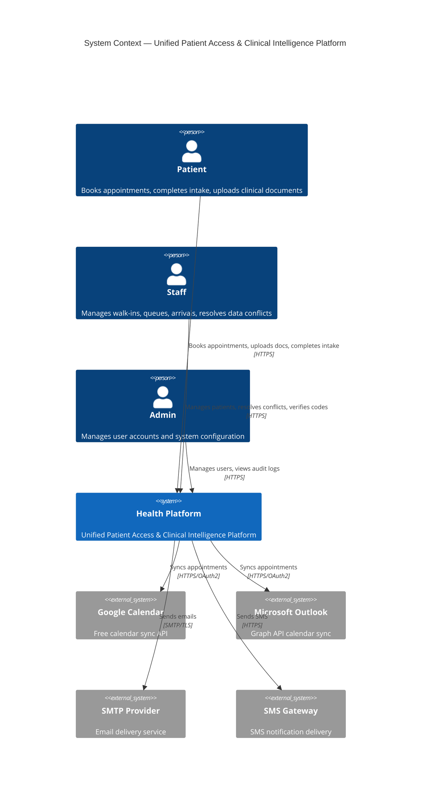
```mermaid
C4Context
    title System Context — Unified Patient Access & Clinical Intelligence Platform

    Person(patient, "Patient", "Books appointments, completes intake, uploads clinical documents")
    Person(staff, "Staff", "Manages walk-ins, queues, arrivals, resolves data conflicts")
    Person(admin, "Admin", "Manages user accounts and system configuration")

    System(platform, "Health Platform", "Unified Patient Access & Clinical Intelligence Platform")

    System_Ext(google_cal, "Google Calendar", "Free calendar sync API")
    System_Ext(outlook_cal, "Microsoft Outlook", "Graph API calendar sync")
    System_Ext(smtp, "SMTP Provider", "Email delivery service")
    System_Ext(sms_gw, "SMS Gateway", "SMS notification delivery")

    Rel(patient, platform, "Books appointments, uploads docs, completes intake", "HTTPS")
    Rel(staff, platform, "Manages patients, resolves conflicts, verifies codes", "HTTPS")
    Rel(admin, platform, "Manages users, views audit logs", "HTTPS")
    Rel(platform, google_cal, "Syncs appointments", "HTTPS/OAuth2")
    Rel(platform, outlook_cal, "Syncs appointments", "HTTPS/OAuth2")
    Rel(platform, smtp, "Sends emails", "SMTP/TLS")
    Rel(platform, sms_gw, "Sends SMS", "HTTPS")
```

---

## 2. Component Diagram (C4 Level 2)

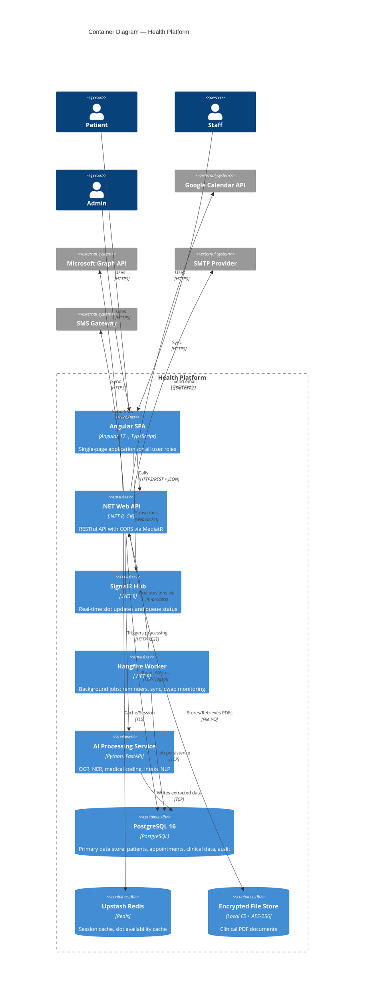
```mermaid
C4Container
    title Container Diagram — Health Platform

    Person(patient, "Patient")
    Person(staff, "Staff")
    Person(admin, "Admin")

    System_Boundary(platform, "Health Platform") {
        Container(spa, "Angular SPA", "Angular 17+, TypeScript", "Single-page application for all user roles")
        Container(api, ".NET Web API", ".NET 8, C#", "RESTful API with CQRS via MediatR")
        Container(signalr, "SignalR Hub", ".NET 8", "Real-time slot updates and queue status")
        Container(hangfire, "Hangfire Worker", ".NET 8", "Background jobs: reminders, sync, swap monitoring")
        Container(ai_svc, "AI Processing Service", "Python, FastAPI", "OCR, NER, medical coding, intake NLP")
        ContainerDb(postgres, "PostgreSQL 16", "PostgreSQL", "Primary data store: patients, appointments, clinical data, audit")
        ContainerDb(redis, "Upstash Redis", "Redis", "Session cache, slot availability cache")
        ContainerDb(file_store, "Encrypted File Store", "Local FS + AES-256", "Clinical PDF documents")
    }

    System_Ext(google_cal, "Google Calendar API")
    System_Ext(outlook_cal, "Microsoft Graph API")
    System_Ext(smtp, "SMTP Provider")
    System_Ext(sms_gw, "SMS Gateway")

    Rel(patient, spa, "Uses", "HTTPS")
    Rel(staff, spa, "Uses", "HTTPS")
    Rel(admin, spa, "Uses", "HTTPS")
    Rel(spa, api, "Calls", "HTTPS/REST + JSON")
    Rel(spa, signalr, "Subscribes", "WebSocket")
    Rel(api, postgres, "Reads/Writes", "TCP/Npgsql")
    Rel(api, redis, "Cache/Session", "TLS")
    Rel(api, ai_svc, "Triggers processing", "HTTP/REST")
    Rel(api, file_store, "Stores/Retrieves PDFs", "File I/O")
    Rel(hangfire, api, "Executes jobs via", "In-process")
    Rel(hangfire, postgres, "Job persistence", "TCP")
    Rel(api, google_cal, "Sync", "HTTPS")
    Rel(api, outlook_cal, "Sync", "HTTPS")
    Rel(api, smtp, "Send email", "SMTP/TLS")
    Rel(api, sms_gw, "Send SMS", "HTTPS")
    Rel(ai_svc, postgres, "Writes extracted data", "TCP")
```

---

## 3. Deployment Diagram

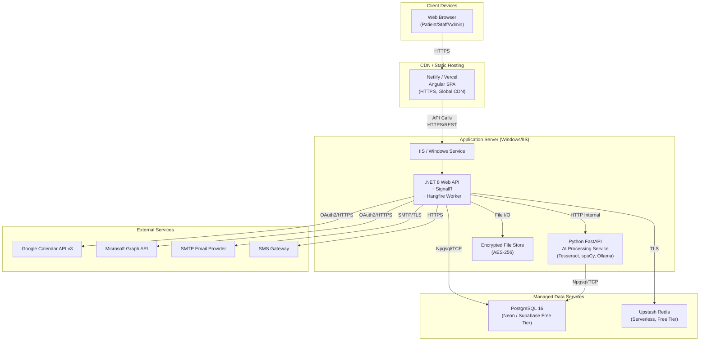
```mermaid
graph TB
    subgraph "Client Devices"
        Browser["Web Browser<br/>(Patient/Staff/Admin)"]
    end

    subgraph "CDN / Static Hosting"
        Netlify["Netlify / Vercel<br/>Angular SPA<br/>(HTTPS, Global CDN)"]
    end

    subgraph "Application Server (Windows/IIS)"
        IIS["IIS / Windows Service"]
        DotNet[".NET 8 Web API<br/>+ SignalR<br/>+ Hangfire Worker"]
        AI["Python FastAPI<br/>AI Processing Service<br/>(Tesseract, spaCy, Ollama)"]
        FileStore["Encrypted File Store<br/>(AES-256)"]
    end

    subgraph "Managed Data Services"
        PG["PostgreSQL 16<br/>(Neon / Supabase Free Tier)"]
        Redis["Upstash Redis<br/>(Serverless, Free Tier)"]
    end

    subgraph "External Services"
        Google["Google Calendar API v3"]
        MSFT["Microsoft Graph API"]
        SMTP["SMTP Email Provider"]
        SMS["SMS Gateway"]
    end

    Browser -->|HTTPS| Netlify
    Netlify -->|API Calls<br/>HTTPS/REST| IIS
    IIS --> DotNet
    DotNet -->|HTTP Internal| AI
    DotNet -->|Npgsql/TCP| PG
    DotNet -->|TLS| Redis
    DotNet -->|File I/O| FileStore
    DotNet -->|OAuth2/HTTPS| Google
    DotNet -->|OAuth2/HTTPS| MSFT
    DotNet -->|SMTP/TLS| SMTP
    DotNet -->|HTTPS| SMS
    AI -->|Npgsql/TCP| PG
```

---

## 4. Entity Relationship Diagram (ERD)

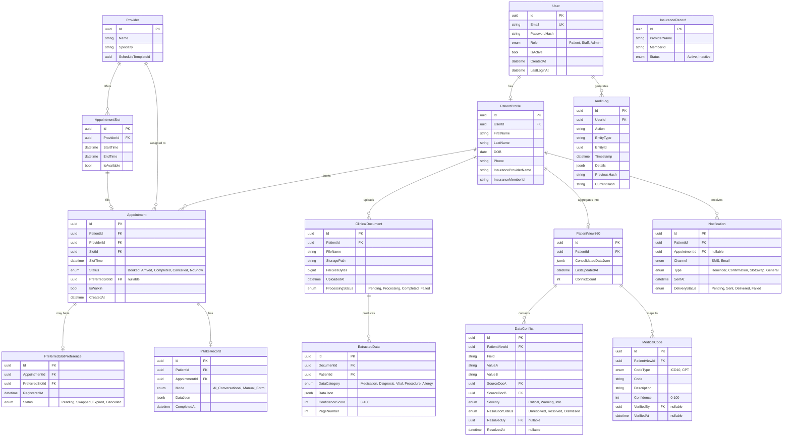
```mermaid
erDiagram
    User ||--o| PatientProfile : "has"
    User {
        uuid Id PK
        string Email UK
        string PasswordHash
        enum Role "Patient, Staff, Admin"
        bool IsActive
        datetime CreatedAt
        datetime LastLoginAt
    }

    PatientProfile {
        uuid Id PK
        uuid UserId FK
        string FirstName
        string LastName
        date DOB
        string Phone
        string InsuranceProviderName
        string InsuranceMemberId
    }

    Provider {
        uuid Id PK
        string Name
        string Specialty
        uuid ScheduleTemplateId
    }

    Provider ||--o{ AppointmentSlot : "offers"
    AppointmentSlot {
        uuid Id PK
        uuid ProviderId FK
        datetime StartTime
        datetime EndTime
        bool IsAvailable
    }

    PatientProfile ||--o{ Appointment : "books"
    Provider ||--o{ Appointment : "assigned to"
    AppointmentSlot ||--o| Appointment : "fills"
    Appointment {
        uuid Id PK
        uuid PatientId FK
        uuid ProviderId FK
        uuid SlotId FK
        datetime SlotTime
        enum Status "Booked, Arrived, Completed, Cancelled, NoShow"
        uuid PreferredSlotId FK "nullable"
        bool IsWalkIn
        datetime CreatedAt
    }

    Appointment ||--o| PreferredSlotPreference : "may have"
    PreferredSlotPreference {
        uuid Id PK
        uuid AppointmentId FK
        uuid PreferredSlotId FK
        datetime RegisteredAt
        enum Status "Pending, Swapped, Expired, Cancelled"
    }

    Appointment ||--o| IntakeRecord : "has"
    IntakeRecord {
        uuid Id PK
        uuid PatientId FK
        uuid AppointmentId FK
        enum Mode "AI_Conversational, Manual_Form"
        jsonb DataJson
        datetime CompletedAt
    }

    PatientProfile ||--o{ ClinicalDocument : "uploads"
    ClinicalDocument {
        uuid Id PK
        uuid PatientId FK
        string FileName
        string StoragePath
        bigint FileSizeBytes
        datetime UploadedAt
        enum ProcessingStatus "Pending, Processing, Completed, Failed"
    }

    ClinicalDocument ||--o{ ExtractedData : "produces"
    ExtractedData {
        uuid Id PK
        uuid DocumentId FK
        uuid PatientId FK
        enum DataCategory "Medication, Diagnosis, Vital, Procedure, Allergy"
        jsonb DataJson
        int ConfidenceScore "0-100"
        int PageNumber
    }

    PatientProfile ||--o| PatientView360 : "aggregates into"
    PatientView360 {
        uuid Id PK
        uuid PatientId FK
        jsonb ConsolidatedDataJson
        datetime LastUpdatedAt
        int ConflictCount
    }

    PatientView360 ||--o{ DataConflict : "contains"
    DataConflict {
        uuid Id PK
        uuid PatientViewId FK
        string Field
        string ValueA
        string ValueB
        uuid SourceDocA FK
        uuid SourceDocB FK
        enum Severity "Critical, Warning, Info"
        enum ResolutionStatus "Unresolved, Resolved, Dismissed"
        uuid ResolvedBy FK "nullable"
        datetime ResolvedAt "nullable"
    }

    PatientView360 ||--o{ MedicalCode : "maps to"
    MedicalCode {
        uuid Id PK
        uuid PatientViewId FK
        enum CodeType "ICD10, CPT"
        string Code
        string Description
        int Confidence "0-100"
        uuid VerifiedBy FK "nullable"
        datetime VerifiedAt "nullable"
    }

    User ||--o{ AuditLog : "generates"
    AuditLog {
        uuid Id PK
        uuid UserId FK
        string Action
        string EntityType
        uuid EntityId
        datetime Timestamp
        jsonb Details
        string PreviousHash
        string CurrentHash
    }

    PatientProfile ||--o{ Notification : "receives"
    Notification {
        uuid Id PK
        uuid PatientId FK
        uuid AppointmentId FK "nullable"
        enum Channel "SMS, Email"
        enum Type "Reminder, Confirmation, SlotSwap, General"
        datetime SentAt
        enum DeliveryStatus "Pending, Sent, Delivered, Failed"
    }

    InsuranceRecord {
        uuid Id PK
        string ProviderName
        string MemberId
        enum Status "Active, Inactive"
    }
```

---

## 5. Data Flow Diagrams

### 5.1 Appointment Booking Data Flow

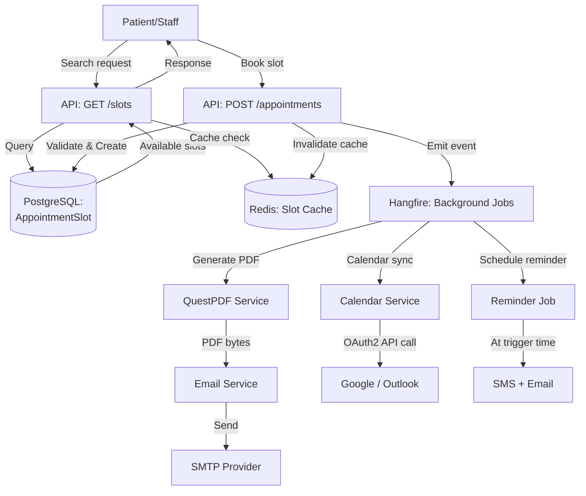
```mermaid
flowchart TD
    A[Patient/Staff] -->|Search request| B[API: GET /slots]
    B -->|Query| C[(PostgreSQL:<br/>AppointmentSlot)]
    C -->|Available slots| B
    B -->|Cache check| D[(Redis: Slot Cache)]
    B -->|Response| A

    A -->|Book slot| E[API: POST /appointments]
    E -->|Validate & Create| C
    E -->|Invalidate cache| D
    E -->|Emit event| F[Hangfire: Background Jobs]

    F -->|Generate PDF| G[QuestPDF Service]
    G -->|PDF bytes| H[Email Service]
    H -->|Send| I[SMTP Provider]

    F -->|Calendar sync| J[Calendar Service]
    J -->|OAuth2 API call| K[Google / Outlook]

    F -->|Schedule reminder| L[Reminder Job]
    L -->|At trigger time| M[SMS + Email]
```

### 5.2 Clinical Document Processing Data Flow

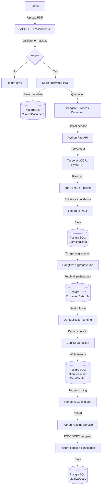
```mermaid
flowchart TD
    A[Patient] -->|Upload PDF| B[API: POST /documents]
    B -->|Validate format/size| C{Valid?}
    C -->|No| D[Return error]
    C -->|Yes| E[Store encrypted PDF]
    E -->|Save metadata| F[(PostgreSQL:<br/>ClinicalDocument)]
    E -->|Queue job| G[Hangfire: Process Document]

    G -->|Call AI service| H[Python FastAPI]
    H -->|Extract text| I[Tesseract OCR /<br/>PyMuPDF]
    I -->|Raw text| J[spaCy NER Pipeline]
    J -->|Entities + confidence| K[Return to .NET]

    K -->|Save| L[(PostgreSQL:<br/>ExtractedData)]
    L -->|Trigger aggregation| M[Hangfire: Aggregate Job]

    M -->|Fetch all patient data| N[(PostgreSQL:<br/>ExtractedData * N)]
    N -->|De-duplicate| O[De-duplication Engine]
    O -->|Detect conflicts| P[Conflict Detection]
    P -->|Write results| Q[(PostgreSQL:<br/>PatientView360 +<br/>DataConflict)]

    Q -->|Trigger coding| R[Hangfire: Coding Job]
    R -->|Call AI| S[Python: Coding Service]
    S -->|ICD-10/CPT mapping| T[Return codes + confidence]
    T -->|Save| U[(PostgreSQL:<br/>MedicalCode)]
```

### 5.3 Preferred Slot Swap Data Flow

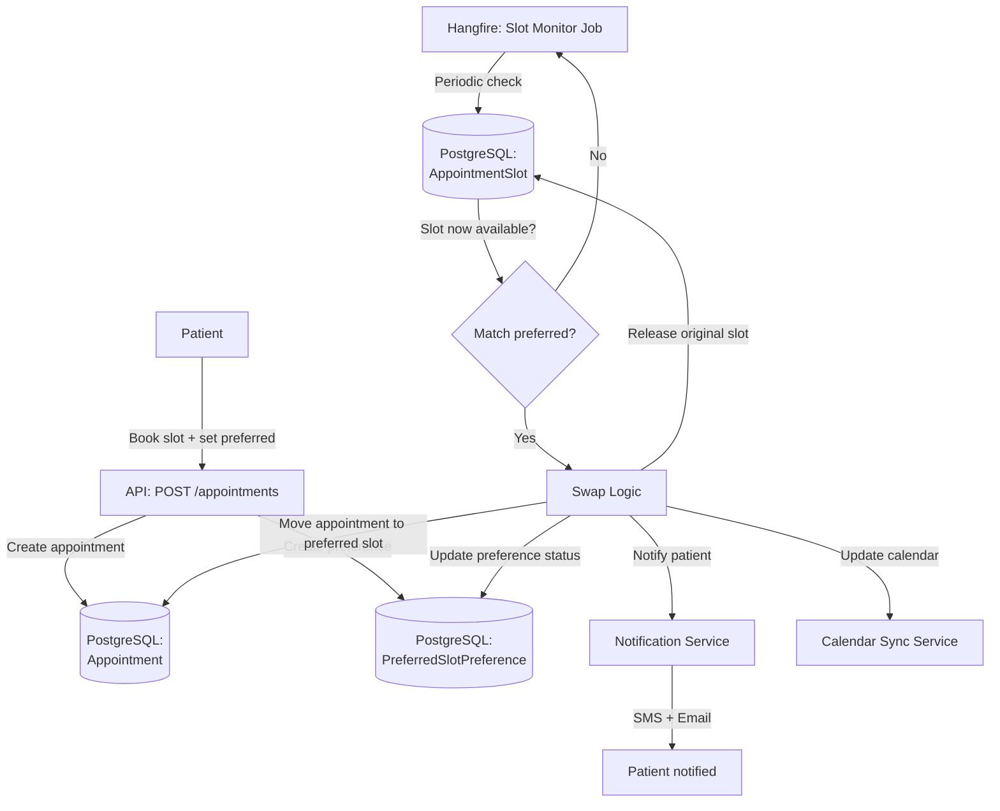
```mermaid
flowchart TD
    A[Patient] -->|Book slot + set preferred| B[API: POST /appointments]
    B -->|Create appointment| C[(PostgreSQL:<br/>Appointment)]
    B -->|Create preference| D[(PostgreSQL:<br/>PreferredSlotPreference)]

    E[Hangfire: Slot Monitor Job] -->|Periodic check| F[(PostgreSQL:<br/>AppointmentSlot)]
    F -->|Slot now available?| G{Match preferred?}
    G -->|No| E
    G -->|Yes| H[Swap Logic]

    H -->|Move appointment to preferred slot| C
    H -->|Release original slot| F
    H -->|Update preference status| D
    H -->|Notify patient| I[Notification Service]
    I -->|SMS + Email| J[Patient notified]
    H -->|Update calendar| K[Calendar Sync Service]
```

---

## 6. Sequence Diagrams

### 6.1 Patient Books Appointment (UC-001)

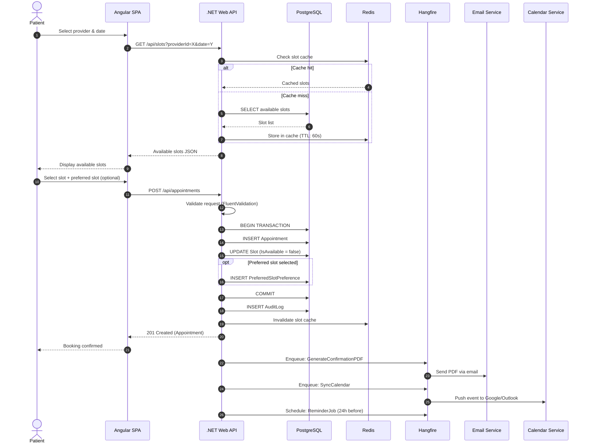
```mermaid
sequenceDiagram
    autonumber
    actor Patient
    participant SPA as Angular SPA
    participant API as .NET Web API
    participant DB as PostgreSQL
    participant Cache as Redis
    participant HF as Hangfire
    participant Email as Email Service
    participant Cal as Calendar Service

    Patient->>SPA: Select provider & date
    SPA->>API: GET /api/slots?providerId=X&date=Y
    API->>Cache: Check slot cache
    alt Cache hit
        Cache-->>API: Cached slots
    else Cache miss
        API->>DB: SELECT available slots
        DB-->>API: Slot list
        API->>Cache: Store in cache (TTL: 60s)
    end
    API-->>SPA: Available slots JSON
    SPA-->>Patient: Display available slots

    Patient->>SPA: Select slot + preferred slot (optional)
    SPA->>API: POST /api/appointments
    API->>API: Validate request (FluentValidation)
    API->>DB: BEGIN TRANSACTION
    API->>DB: INSERT Appointment
    API->>DB: UPDATE Slot (IsAvailable = false)
    opt Preferred slot selected
        API->>DB: INSERT PreferredSlotPreference
    end
    API->>DB: COMMIT
    API->>DB: INSERT AuditLog
    API->>Cache: Invalidate slot cache
    API-->>SPA: 201 Created (Appointment)
    SPA-->>Patient: Booking confirmed

    API->>HF: Enqueue: GenerateConfirmationPDF
    HF->>Email: Send PDF via email
    API->>HF: Enqueue: SyncCalendar
    HF->>Cal: Push event to Google/Outlook
    API->>HF: Schedule: ReminderJob (24h before)
```

### 6.2 Staff Walk-in Registration (UC-003)

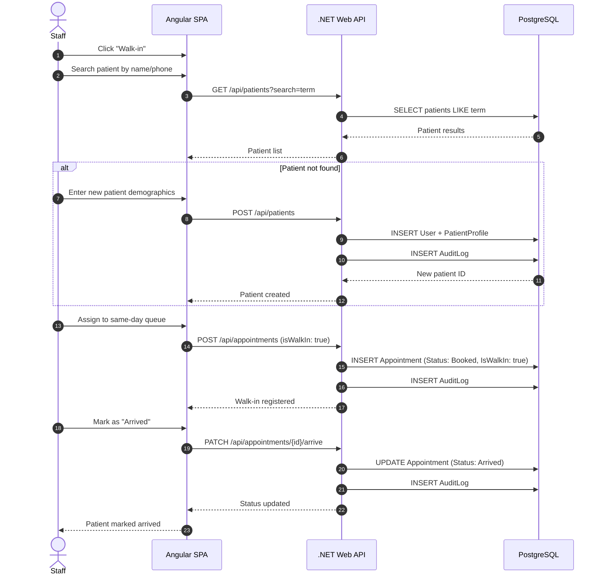
```mermaid
sequenceDiagram
    autonumber
    actor Staff
    participant SPA as Angular SPA
    participant API as .NET Web API
    participant DB as PostgreSQL

    Staff->>SPA: Click "Walk-in"
    Staff->>SPA: Search patient by name/phone
    SPA->>API: GET /api/patients?search=term
    API->>DB: SELECT patients LIKE term
    DB-->>API: Patient results
    API-->>SPA: Patient list

    alt Patient not found
        Staff->>SPA: Enter new patient demographics
        SPA->>API: POST /api/patients
        API->>DB: INSERT User + PatientProfile
        API->>DB: INSERT AuditLog
        DB-->>API: New patient ID
        API-->>SPA: Patient created
    end

    Staff->>SPA: Assign to same-day queue
    SPA->>API: POST /api/appointments (isWalkIn: true)
    API->>DB: INSERT Appointment (Status: Booked, IsWalkIn: true)
    API->>DB: INSERT AuditLog
    API-->>SPA: Walk-in registered

    Staff->>SPA: Mark as "Arrived"
    SPA->>API: PATCH /api/appointments/{id}/arrive
    API->>DB: UPDATE Appointment (Status: Arrived)
    API->>DB: INSERT AuditLog
    API-->>SPA: Status updated
    SPA-->>Staff: Patient marked arrived
```

### 6.3 Clinical Document Processing (UC-007 + UC-008)

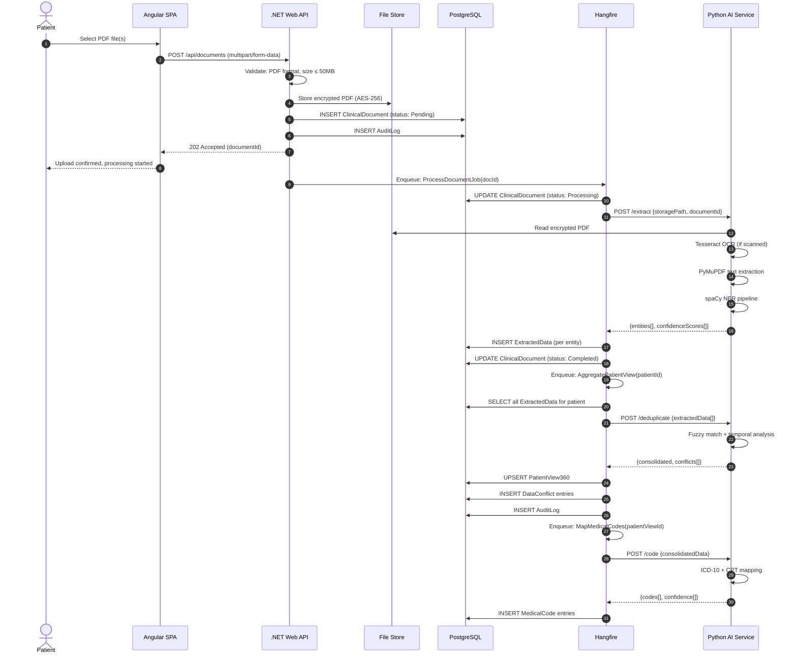
```mermaid
sequenceDiagram
    autonumber
    actor Patient
    participant SPA as Angular SPA
    participant API as .NET Web API
    participant FS as File Store
    participant DB as PostgreSQL
    participant HF as Hangfire
    participant AI as Python AI Service

    Patient->>SPA: Select PDF file(s)
    SPA->>API: POST /api/documents (multipart/form-data)
    API->>API: Validate: PDF format, size ≤ 50MB
    API->>FS: Store encrypted PDF (AES-256)
    API->>DB: INSERT ClinicalDocument (status: Pending)
    API->>DB: INSERT AuditLog
    API-->>SPA: 202 Accepted (documentId)
    SPA-->>Patient: Upload confirmed, processing started

    API->>HF: Enqueue: ProcessDocumentJob(docId)
    HF->>DB: UPDATE ClinicalDocument (status: Processing)
    HF->>AI: POST /extract {storagePath, documentId}

    AI->>FS: Read encrypted PDF
    AI->>AI: Tesseract OCR (if scanned)
    AI->>AI: PyMuPDF text extraction
    AI->>AI: spaCy NER pipeline
    AI-->>HF: {entities[], confidenceScores[]}

    HF->>DB: INSERT ExtractedData (per entity)
    HF->>DB: UPDATE ClinicalDocument (status: Completed)

    HF->>HF: Enqueue: AggregatePatientView(patientId)
    HF->>DB: SELECT all ExtractedData for patient
    HF->>AI: POST /deduplicate {extractedData[]}
    AI->>AI: Fuzzy match + temporal analysis
    AI-->>HF: {consolidated, conflicts[]}

    HF->>DB: UPSERT PatientView360
    HF->>DB: INSERT DataConflict entries
    HF->>DB: INSERT AuditLog

    HF->>HF: Enqueue: MapMedicalCodes(patientViewId)
    HF->>AI: POST /code {consolidatedData}
    AI->>AI: ICD-10 + CPT mapping
    AI-->>HF: {codes[], confidence[]}
    HF->>DB: INSERT MedicalCode entries
```

### 6.4 Preferred Slot Swap Execution (UC-004)

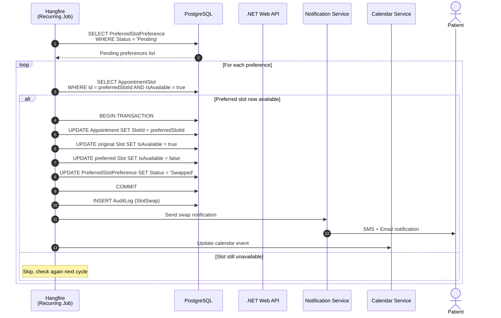
```mermaid
sequenceDiagram
    autonumber
    participant HF as Hangfire<br/>(Recurring Job)
    participant DB as PostgreSQL
    participant API as .NET Web API
    participant Notify as Notification Service
    participant Cal as Calendar Service
    actor Patient

    HF->>DB: SELECT PreferredSlotPreference<br/>WHERE Status = 'Pending'
    DB-->>HF: Pending preferences list

    loop For each preference
        HF->>DB: SELECT AppointmentSlot<br/>WHERE Id = preferredSlotId AND IsAvailable = true
        alt Preferred slot now available
            HF->>DB: BEGIN TRANSACTION
            HF->>DB: UPDATE Appointment SET SlotId = preferredSlotId
            HF->>DB: UPDATE original Slot SET IsAvailable = true
            HF->>DB: UPDATE preferred Slot SET IsAvailable = false
            HF->>DB: UPDATE PreferredSlotPreference SET Status = 'Swapped'
            HF->>DB: COMMIT
            HF->>DB: INSERT AuditLog (SlotSwap)
            HF->>Notify: Send swap notification
            Notify->>Patient: SMS + Email notification
            HF->>Cal: Update calendar event
        else Slot still unavailable
            Note over HF: Skip, check again next cycle
        end
    end
```

### 6.5 Authentication and Session Management

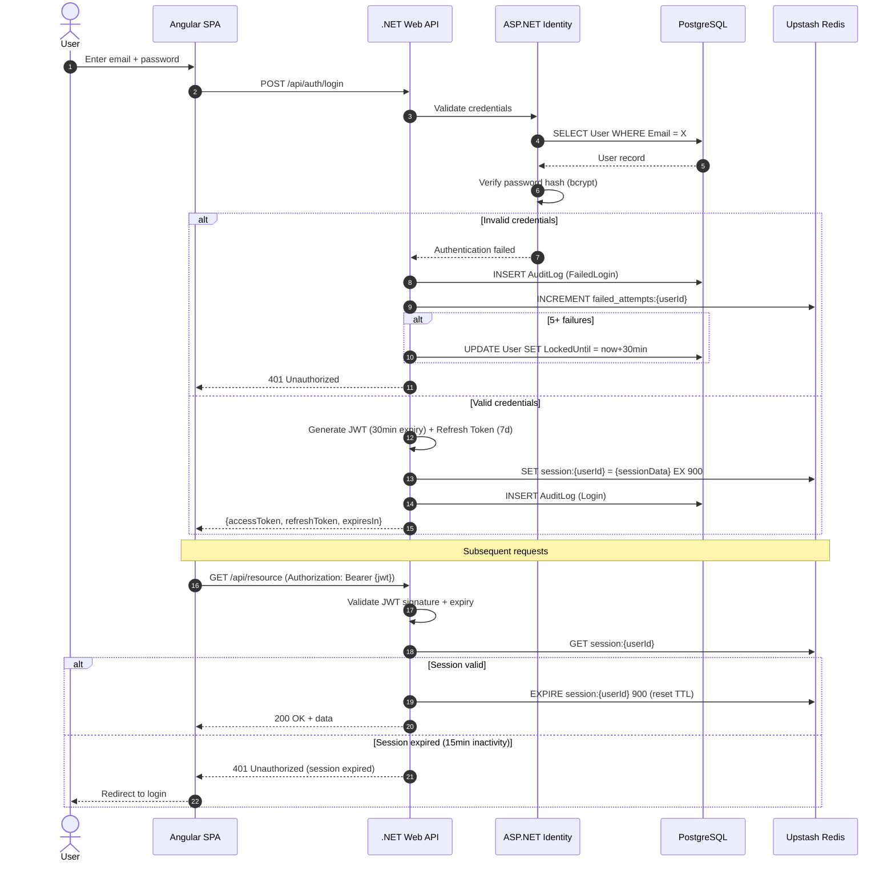
```mermaid
sequenceDiagram
    autonumber
    actor User
    participant SPA as Angular SPA
    participant API as .NET Web API
    participant Identity as ASP.NET Identity
    participant DB as PostgreSQL
    participant Redis as Upstash Redis

    User->>SPA: Enter email + password
    SPA->>API: POST /api/auth/login
    API->>Identity: Validate credentials
    Identity->>DB: SELECT User WHERE Email = X
    DB-->>Identity: User record
    Identity->>Identity: Verify password hash (bcrypt)

    alt Invalid credentials
        Identity-->>API: Authentication failed
        API->>DB: INSERT AuditLog (FailedLogin)
        API->>Redis: INCREMENT failed_attempts:{userId}
        alt 5+ failures
            API->>DB: UPDATE User SET LockedUntil = now+30min
        end
        API-->>SPA: 401 Unauthorized
    else Valid credentials
        API->>API: Generate JWT (30min expiry) + Refresh Token (7d)
        API->>Redis: SET session:{userId} = {sessionData} EX 900
        API->>DB: INSERT AuditLog (Login)
        API-->>SPA: {accessToken, refreshToken, expiresIn}
    end

    Note over SPA,Redis: Subsequent requests
    SPA->>API: GET /api/resource (Authorization: Bearer {jwt})
    API->>API: Validate JWT signature + expiry
    API->>Redis: GET session:{userId}
    alt Session valid
        API->>Redis: EXPIRE session:{userId} 900 (reset TTL)
        API-->>SPA: 200 OK + data
    else Session expired (15min inactivity)
        API-->>SPA: 401 Unauthorized (session expired)
        SPA-->>User: Redirect to login
    end
```

### 6.6 Staff Resolves Data Conflict (UC-009)

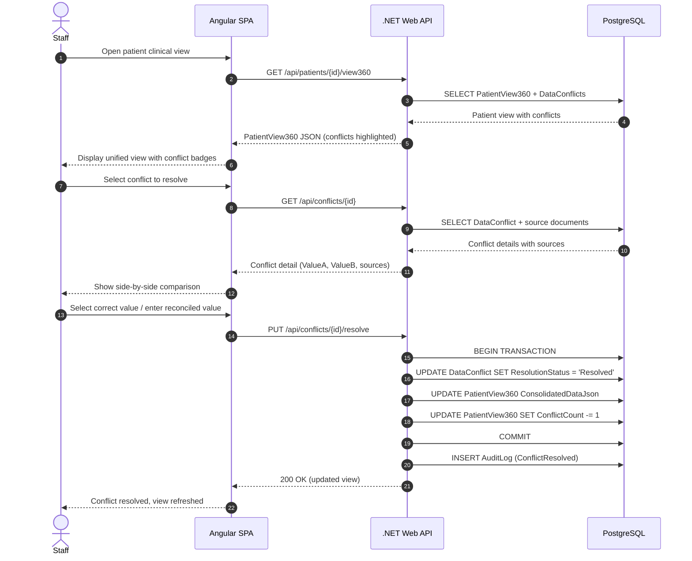
```mermaid
sequenceDiagram
    autonumber
    actor Staff
    participant SPA as Angular SPA
    participant API as .NET Web API
    participant DB as PostgreSQL

    Staff->>SPA: Open patient clinical view
    SPA->>API: GET /api/patients/{id}/view360
    API->>DB: SELECT PatientView360 + DataConflicts
    DB-->>API: Patient view with conflicts
    API-->>SPA: PatientView360 JSON (conflicts highlighted)
    SPA-->>Staff: Display unified view with conflict badges

    Staff->>SPA: Select conflict to resolve
    SPA->>API: GET /api/conflicts/{id}
    API->>DB: SELECT DataConflict + source documents
    DB-->>API: Conflict details with sources
    API-->>SPA: Conflict detail (ValueA, ValueB, sources)
    SPA-->>Staff: Show side-by-side comparison

    Staff->>SPA: Select correct value / enter reconciled value
    SPA->>API: PUT /api/conflicts/{id}/resolve
    API->>DB: BEGIN TRANSACTION
    API->>DB: UPDATE DataConflict SET ResolutionStatus = 'Resolved'
    API->>DB: UPDATE PatientView360 ConsolidatedDataJson
    API->>DB: UPDATE PatientView360 SET ConflictCount -= 1
    API->>DB: COMMIT
    API->>DB: INSERT AuditLog (ConflictResolved)
    API-->>SPA: 200 OK (updated view)
    SPA-->>Staff: Conflict resolved, view refreshed
```

### 6.7 Patient Intake — AI Conversational Mode (UC-005)

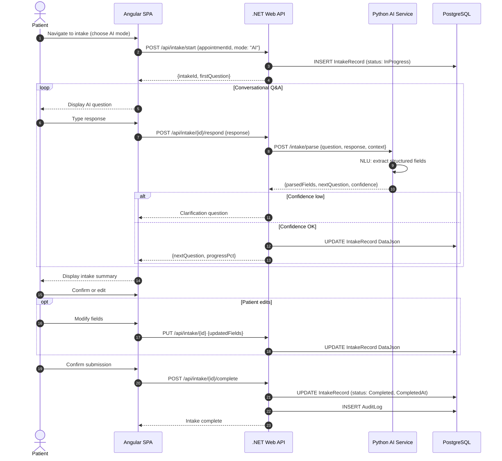
```mermaid
sequenceDiagram
    autonumber
    actor Patient
    participant SPA as Angular SPA
    participant API as .NET Web API
    participant AI as Python AI Service
    participant DB as PostgreSQL

    Patient->>SPA: Navigate to intake (choose AI mode)
    SPA->>API: POST /api/intake/start {appointmentId, mode: "AI"}
    API->>DB: INSERT IntakeRecord (status: InProgress)
    API-->>SPA: {intakeId, firstQuestion}

    loop Conversational Q&A
        SPA-->>Patient: Display AI question
        Patient->>SPA: Type response
        SPA->>API: POST /api/intake/{id}/respond {response}
        API->>AI: POST /intake/parse {question, response, context}
        AI->>AI: NLU: extract structured fields
        AI-->>API: {parsedFields, nextQuestion, confidence}
        alt Confidence low
            API-->>SPA: Clarification question
        else Confidence OK
            API->>DB: UPDATE IntakeRecord DataJson
            API-->>SPA: {nextQuestion, progressPct}
        end
    end

    SPA-->>Patient: Display intake summary
    Patient->>SPA: Confirm or edit
    opt Patient edits
        Patient->>SPA: Modify fields
        SPA->>API: PUT /api/intake/{id} {updatedFields}
        API->>DB: UPDATE IntakeRecord DataJson
    end
    Patient->>SPA: Confirm submission
    SPA->>API: POST /api/intake/{id}/complete
    API->>DB: UPDATE IntakeRecord (status: Completed, CompletedAt)
    API->>DB: INSERT AuditLog
    API-->>SPA: Intake complete
```

---

## 7. Component Internal Structure (Backend Clean Architecture)

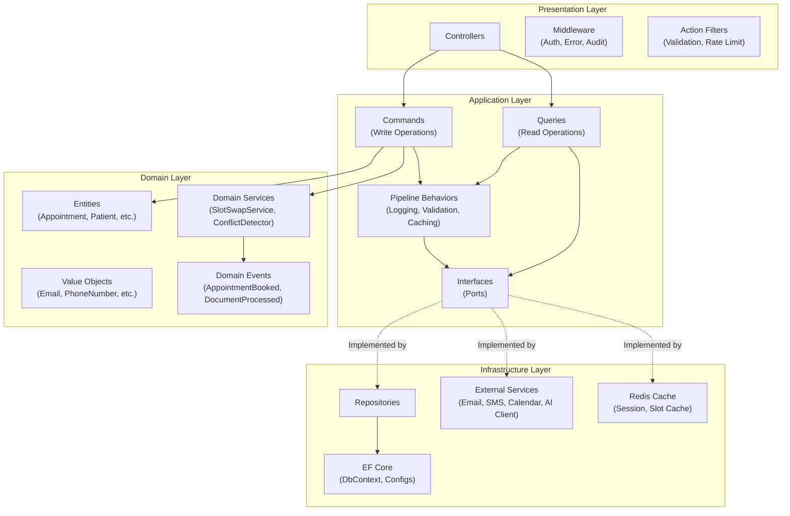
```mermaid
graph TB
    subgraph "Presentation Layer"
        Controllers["Controllers"]
        Middleware["Middleware<br/>(Auth, Error, Audit)"]
        Filters["Action Filters<br/>(Validation, Rate Limit)"]
    end

    subgraph "Application Layer"
        Commands["Commands<br/>(Write Operations)"]
        Queries["Queries<br/>(Read Operations)"]
        Behaviors["Pipeline Behaviors<br/>(Logging, Validation, Caching)"]
        Interfaces["Interfaces<br/>(Ports)"]
    end

    subgraph "Domain Layer"
        Entities["Entities<br/>(Appointment, Patient, etc.)"]
        ValueObjects["Value Objects<br/>(Email, PhoneNumber, etc.)"]
        DomainEvents["Domain Events<br/>(AppointmentBooked, DocumentProcessed)"]
        DomainServices["Domain Services<br/>(SlotSwapService, ConflictDetector)"]
    end

    subgraph "Infrastructure Layer"
        EFCore["EF Core<br/>(DbContext, Configs)"]
        Repositories["Repositories"]
        ExternalSvc["External Services<br/>(Email, SMS, Calendar, AI Client)"]
        Caching["Redis Cache<br/>(Session, Slot Cache)"]
    end

    Controllers --> Commands
    Controllers --> Queries
    Commands --> Behaviors
    Queries --> Behaviors
    Behaviors --> Interfaces
    Commands --> Entities
    Commands --> DomainServices
    Queries --> Interfaces
    DomainServices --> DomainEvents
    Interfaces -.->|Implemented by| Repositories
    Interfaces -.->|Implemented by| ExternalSvc
    Interfaces -.->|Implemented by| Caching
    Repositories --> EFCore
```

---

## 8. State Diagrams

### 8.1 Appointment State Machine

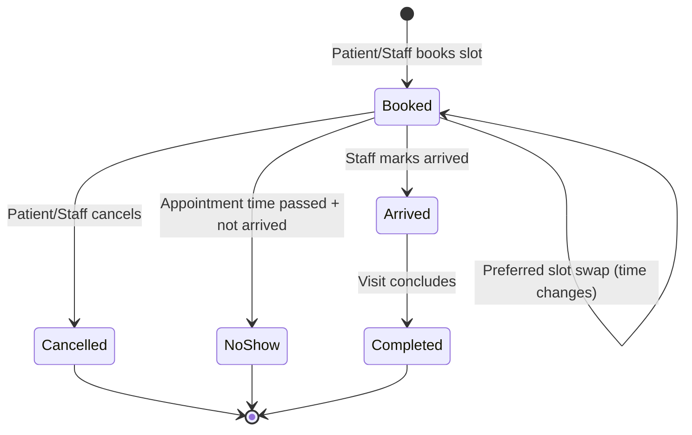
```mermaid
stateDiagram-v2
    [*] --> Booked : Patient/Staff books slot
    Booked --> Arrived : Staff marks arrived
    Booked --> Cancelled : Patient/Staff cancels
    Booked --> NoShow : Appointment time passed + not arrived
    Booked --> Booked : Preferred slot swap (time changes)
    Arrived --> Completed : Visit concludes
    Cancelled --> [*]
    NoShow --> [*]
    Completed --> [*]
```

### 8.2 Clinical Document Processing State Machine

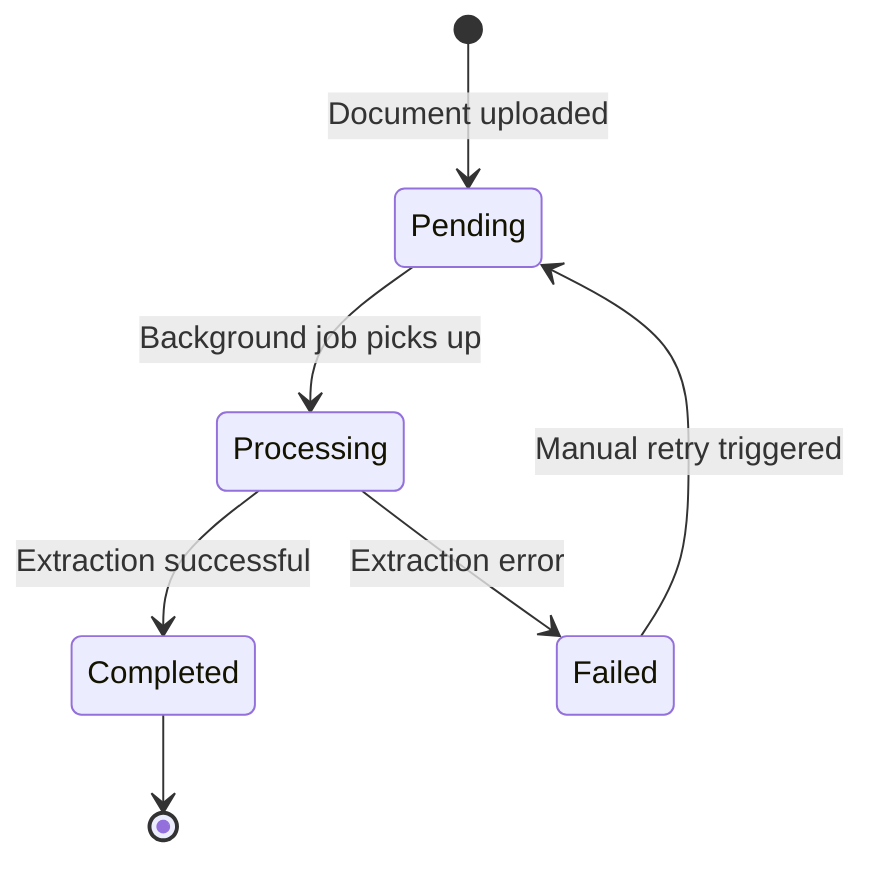
```mermaid
stateDiagram-v2
    [*] --> Pending : Document uploaded
    Pending --> Processing : Background job picks up
    Processing --> Completed : Extraction successful
    Processing --> Failed : Extraction error
    Failed --> Pending : Manual retry triggered
    Completed --> [*]
```

### 8.3 Preferred Slot Preference State Machine

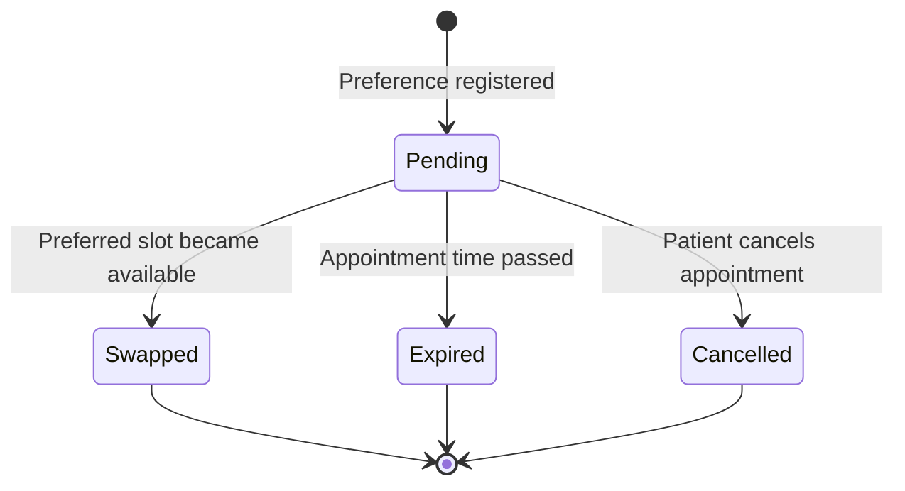
```mermaid
stateDiagram-v2
    [*] --> Pending : Preference registered
    Pending --> Swapped : Preferred slot became available
    Pending --> Expired : Appointment time passed
    Pending --> Cancelled : Patient cancels appointment
    Swapped --> [*]
    Expired --> [*]
    Cancelled --> [*]
```

### 8.4 Data Conflict Resolution State Machine

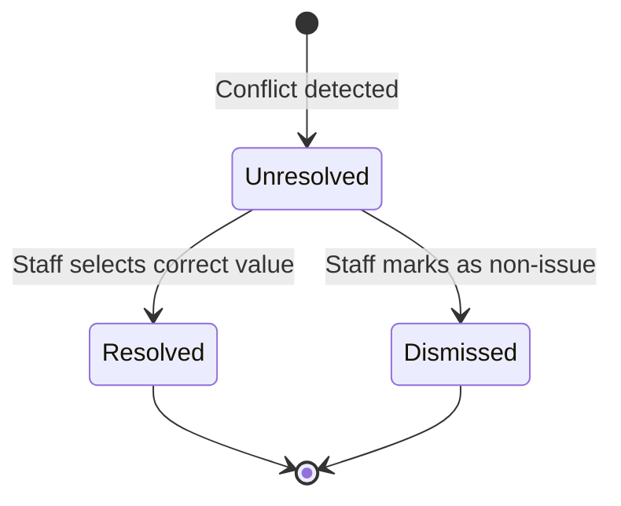
```mermaid
stateDiagram-v2
    [*] --> Unresolved : Conflict detected
    Unresolved --> Resolved : Staff selects correct value
    Unresolved --> Dismissed : Staff marks as non-issue
    Resolved --> [*]
    Dismissed --> [*]
```

---

## 9. Package Diagram (Backend .NET Solution)

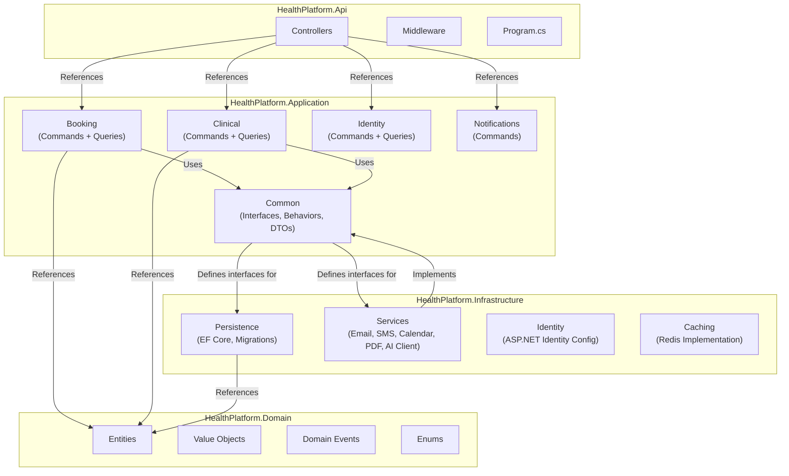
```mermaid
graph TB
    subgraph "HealthPlatform.Api"
        A_Controllers["Controllers"]
        A_Middleware["Middleware"]
        A_Program["Program.cs"]
    end

    subgraph "HealthPlatform.Application"
        App_Booking["Booking<br/>(Commands + Queries)"]
        App_Clinical["Clinical<br/>(Commands + Queries)"]
        App_Identity["Identity<br/>(Commands + Queries)"]
        App_Notify["Notifications<br/>(Commands)"]
        App_Common["Common<br/>(Interfaces, Behaviors, DTOs)"]
    end

    subgraph "HealthPlatform.Domain"
        Dom_Entities["Entities"]
        Dom_ValueObj["Value Objects"]
        Dom_Events["Domain Events"]
        Dom_Enums["Enums"]
    end

    subgraph "HealthPlatform.Infrastructure"
        Inf_Persist["Persistence<br/>(EF Core, Migrations)"]
        Inf_Services["Services<br/>(Email, SMS, Calendar, PDF, AI Client)"]
        Inf_Identity["Identity<br/>(ASP.NET Identity Config)"]
        Inf_Cache["Caching<br/>(Redis Implementation)"]
    end

    A_Controllers -->|References| App_Booking
    A_Controllers -->|References| App_Clinical
    A_Controllers -->|References| App_Identity
    A_Controllers -->|References| App_Notify
    App_Booking -->|References| Dom_Entities
    App_Clinical -->|References| Dom_Entities
    App_Booking -->|Uses| App_Common
    App_Clinical -->|Uses| App_Common
    App_Common -->|Defines interfaces for| Inf_Persist
    App_Common -->|Defines interfaces for| Inf_Services
    Inf_Persist -->|References| Dom_Entities
    Inf_Services -->|Implements| App_Common
```

---

## 10. Frontend Module Interaction Diagram

```mermaid
graph TB
    subgraph "Core Module"
        AuthService["AuthService"]
        HttpInterceptor["JWT Interceptor"]
        Guards["Route Guards"]
        ErrorHandler["Global Error Handler"]
    end

    subgraph "Feature: Booking"
        BookingComp["Booking Components"]
        SlotService["Slot Service"]
        BookingState["Booking State"]
    end

    subgraph "Feature: Intake"
        IntakeComp["Intake Components"]
        AIChat["AI Chat Component"]
        ManualForm["Manual Form Component"]
        IntakeService["Intake Service"]
    end

    subgraph "Feature: Clinical"
        View360["360° View Component"]
        ConflictPanel["Conflict Panel"]
        CodingPanel["Medical Coding Panel"]
        ClinicalService["Clinical Service"]
    end

    subgraph "Feature: Admin"
        UserMgmt["User Management"]
        AuditViewer["Audit Log Viewer"]
        AdminService["Admin Service"]
    end

    subgraph "Shared"
        UIComponents["UI Components<br/>(Material/PrimeNG)"]
        Models["Shared Models/DTOs"]
        Pipes["Shared Pipes"]
    end

    AuthService --> Guards
    HttpInterceptor --> AuthService
    BookingComp --> SlotService
    BookingComp --> UIComponents
    IntakeComp --> AIChat
    IntakeComp --> ManualForm
    IntakeComp --> IntakeService
    View360 --> ClinicalService
    View360 --> ConflictPanel
    View360 --> CodingPanel
    UserMgmt --> AdminService
    SlotService --> HttpInterceptor
    IntakeService --> HttpInterceptor
    ClinicalService --> HttpInterceptor
    AdminService --> HttpInterceptor
```

---

## 11. Traceability

| Diagram | Covers Requirements |
|---------|-------------------|
| Context Diagram (§1) | System boundary, actors, external integrations |
| Container Diagram (§2) | TR-001–TR-034, ADR-001, ADR-003 |
| Deployment Diagram (§3) | TR-031–TR-034, NFR-007 |
| ERD (§4) | DR-001–DR-015 |
| Data Flow: Booking (§5.1) | FR-006, FR-007, FR-013, FR-022, FR-023 |
| Data Flow: Clinical (§5.2) | FR-032–FR-036, AIR-001–AIR-020 |
| Data Flow: Slot Swap (§5.3) | FR-014–FR-017 |
| Sequence: Book Appointment (§6.1) | UC-001, FR-006, FR-007, FR-013 |
| Sequence: Walk-in (§6.2) | UC-003, FR-009–FR-011 |
| Sequence: Document Processing (§6.3) | UC-007, UC-008, FR-032–FR-038, AIR-001–AIR-020 |
| Sequence: Slot Swap (§6.4) | UC-004, FR-014–FR-017 |
| Sequence: Authentication (§6.5) | FR-001–FR-005, NFR-011–NFR-016 |
| Sequence: Conflict Resolution (§6.6) | UC-009, FR-038, FR-039 |
| Sequence: AI Intake (§6.7) | UC-005, FR-027–FR-031, AIR-021–AIR-025 |
| State: Appointment (§8.1) | FR-007, FR-009, FR-011 |
| State: Document (§8.2) | FR-032–FR-034 |
| State: Slot Preference (§8.3) | FR-014–FR-016 |
| State: Conflict (§8.4) | FR-038, FR-039 |
| Package Diagram (§9) | TR-009, ADR-001 |
| Frontend Modules (§10) | TR-001–TR-007 |
