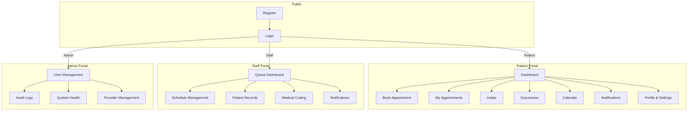
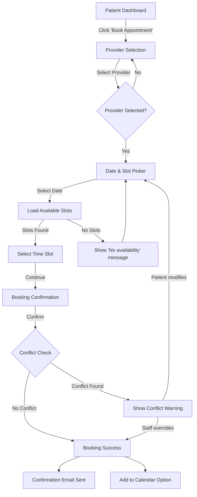
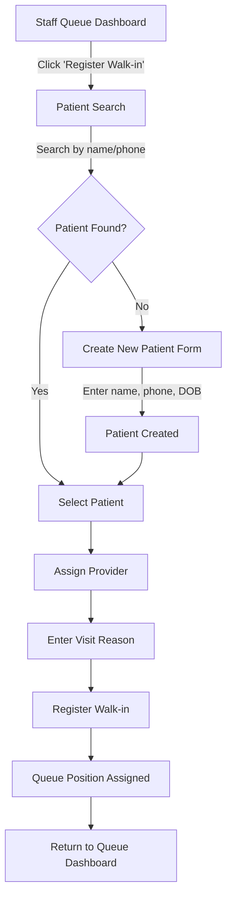
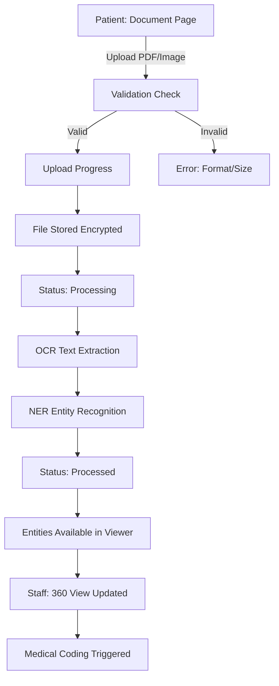
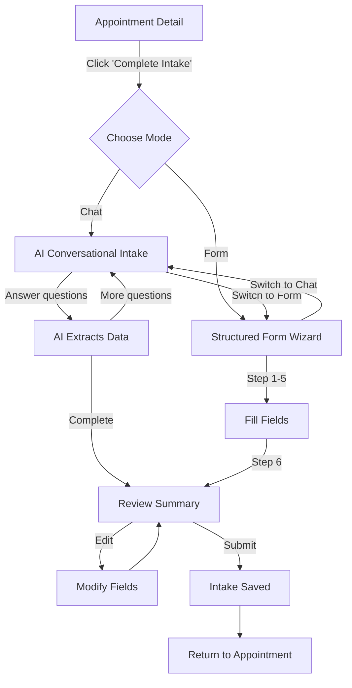
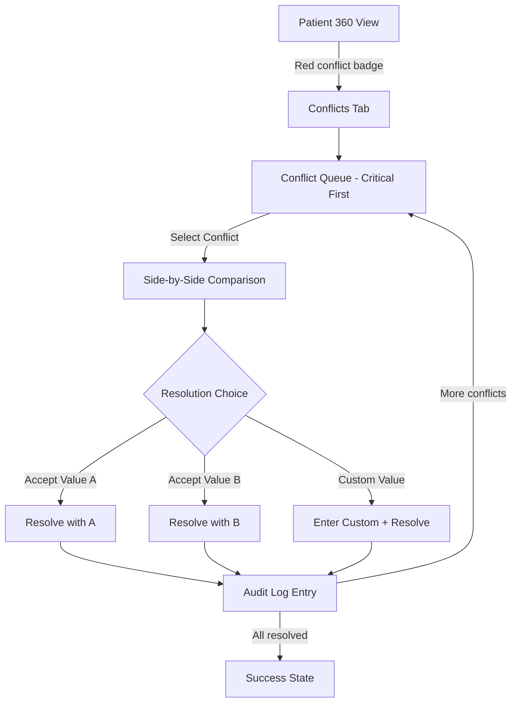
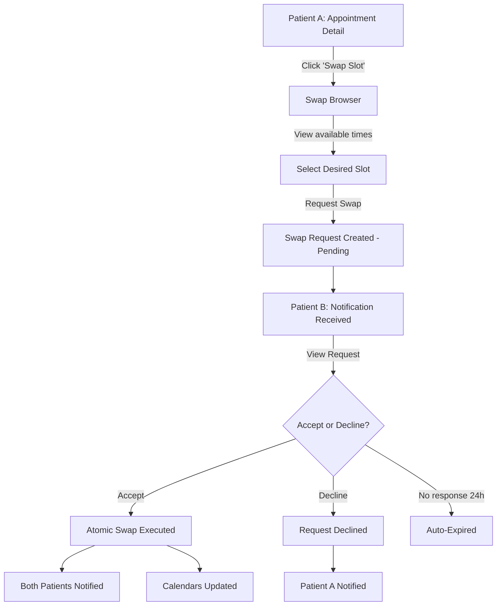

# Wireframe Specification

## Document Information

| Field | Value |
|-------|-------|
| **Project** | Unified Patient Access & Clinical Intelligence Platform |
| **Version** | 1.0 |
| **Status** | Draft |
| **Source** | figma_spec.md, spec.md, design.md |
| **Fidelity** | Mid-fidelity (structural layout with content hierarchy) |
| **Phase** | Phase 1 |

---

## 1. Site Architecture Map



---

## 2. User Flow Diagrams

### 2.1 Appointment Booking Flow



### 2.2 Walk-in Registration Flow



### 2.3 Document Processing Flow



### 2.4 Intake Completion Flow



### 2.5 Conflict Resolution Flow



### 2.6 Slot Swap Flow



---

## 3. Wireframes — Authentication

### 3.1 WF-AUTH-001: Login (Desktop)

```
┌─────────────────────────────────────────────────────────────────────────────┐
│  ┌──────┐                                                                   │
│  │ LOGO │              Unified Patient Access Platform                       │
│  └──────┘                                                                   │
├─────────────────────────────────────────────────────────────────────────────┤
│                                                                             │
│                    ┌─────────────────────────────────┐                      │
│                    │                                 │                      │
│                    │        Welcome Back             │                      │
│                    │                                 │                      │
│                    │  ┌───────────────────────────┐  │                      │
│                    │  │ Email                     │  │                      │
│                    │  └───────────────────────────┘  │                      │
│                    │                                 │                      │
│                    │  ┌───────────────────────────┐  │                      │
│                    │  │ Password            [👁]  │  │                      │
│                    │  └───────────────────────────┘  │                      │
│                    │                                 │                      │
│                    │  ☐ Remember me                  │                      │
│                    │                                 │                      │
│                    │  ┌───────────────────────────┐  │                      │
│                    │  │        Sign In            │  │                      │
│                    │  └───────────────────────────┘  │                      │
│                    │                                 │                      │
│                    │  Forgot password?               │                      │
│                    │                                 │                      │
│                    │  Don't have an account?         │                      │
│                    │  Register →                     │                      │
│                    │                                 │                      │
│                    └─────────────────────────────────┘                      │
│                                                                             │
└─────────────────────────────────────────────────────────────────────────────┘
```

### 3.2 WF-AUTH-001: Login (Mobile)

```
┌───────────────────────┐
│  ┌──────┐             │
│  │ LOGO │             │
│  └──────┘             │
│                       │
│    Welcome Back       │
│                       │
│  ┌─────────────────┐  │
│  │ Email           │  │
│  └─────────────────┘  │
│                       │
│  ┌─────────────────┐  │
│  │ Password   [👁] │  │
│  └─────────────────┘  │
│                       │
│  ☐ Remember me        │
│                       │
│  ┌─────────────────┐  │
│  │    Sign In      │  │
│  └─────────────────┘  │
│                       │
│  Forgot password?     │
│                       │
│  No account?          │
│  Register →           │
│                       │
└───────────────────────┘
```

### 3.3 WF-AUTH-002: Registration (Desktop)

```
┌─────────────────────────────────────────────────────────────────────────────┐
│  ┌──────┐                                                                   │
│  │ LOGO │              Unified Patient Access Platform                       │
│  └──────┘                                                                   │
├─────────────────────────────────────────────────────────────────────────────┤
│                                                                             │
│                    ┌─────────────────────────────────┐                      │
│                    │                                 │                      │
│                    │     Create Your Account         │                      │
│                    │                                 │                      │
│                    │  ┌─────────────┐ ┌───────────┐ │                      │
│                    │  │ First Name  │ │ Last Name │ │                      │
│                    │  └─────────────┘ └───────────┘ │                      │
│                    │                                 │                      │
│                    │  ┌───────────────────────────┐  │                      │
│                    │  │ Email                     │  │                      │
│                    │  └───────────────────────────┘  │                      │
│                    │                                 │                      │
│                    │  ┌───────────────────────────┐  │                      │
│                    │  │ Phone Number              │  │                      │
│                    │  └───────────────────────────┘  │                      │
│                    │                                 │                      │
│                    │  ┌───────────────────────────┐  │                      │
│                    │  │ Password            [👁]  │  │                      │
│                    │  └───────────────────────────┘  │                      │
│                    │  ■■■■□□ Strength: Good          │                      │
│                    │  ✓ 12+ chars  ✓ Uppercase       │                      │
│                    │  ✓ Number    ○ Special char     │                      │
│                    │                                 │                      │
│                    │  ┌───────────────────────────┐  │                      │
│                    │  │ Confirm Password          │  │                      │
│                    │  └───────────────────────────┘  │                      │
│                    │                                 │                      │
│                    │  ┌───────────────────────────┐  │                      │
│                    │  │     Create Account        │  │                      │
│                    │  └───────────────────────────┘  │                      │
│                    │                                 │                      │
│                    │  Already have an account?       │                      │
│                    │  Sign In →                      │                      │
│                    │                                 │                      │
│                    └─────────────────────────────────┘                      │
│                                                                             │
└─────────────────────────────────────────────────────────────────────────────┘
```

---

## 4. Wireframes — Patient Portal

### 4.1 WF-PAT-001: Patient Dashboard (Desktop)

```
┌─────────────────────────────────────────────────────────────────────────────┐
│  ┌──────┐  Dashboard  Appointments  Intake  Documents  Calendar    🔔 [AV] │
│  │ LOGO │                                                                   │
├──┴──────┴───────────────────────────────────────────────────────────────────┤
│                                                                             │
│  Good morning, Sarah                                    Thursday, May 22    │
│                                                                             │
│  ┌─── Quick Actions ─────────────────────────────────────────────────────┐  │
│  │  [📅 Book Appointment]  [📄 Upload Document]  [📆 View Calendar]     │  │
│  └───────────────────────────────────────────────────────────────────────┘  │
│                                                                             │
│  ┌─── Upcoming Appointments ─────────────────────────────────────────────┐  │
│  │                                                                       │  │
│  │  ┌───────────────────────────────────────────────────────────────┐    │  │
│  │  │ Dr. Patel · Cardiology          May 28, 10:00 AM  [SCHEDULED]│    │  │
│  │  │ Annual checkup                                                │    │  │
│  │  │                      [Complete Intake]  [Cancel]  [Reschedule]│    │  │
│  │  └───────────────────────────────────────────────────────────────┘    │  │
│  │                                                                       │  │
│  │  ┌───────────────────────────────────────────────────────────────┐    │  │
│  │  │ Dr. Lee · Dermatology           Jun 3, 2:30 PM   [SCHEDULED] │    │  │
│  │  │ Follow-up                                                     │    │  │
│  │  │                                           [Cancel]  [Reschedule]│  │  │
│  │  └───────────────────────────────────────────────────────────────┘    │  │
│  │                                                                       │  │
│  │  No more upcoming appointments    [Book New →]                        │  │
│  └───────────────────────────────────────────────────────────────────────┘  │
│                                                                             │
│  ┌─── Pending Intake ────────────────────┐  ┌─── Recent Activity ────────┐ │
│  │                                       │  │                            │ │
│  │  ⚠ Complete your pre-visit intake     │  │  🔔 Appointment confirmed  │ │
│  │  for Dr. Patel on May 28              │  │     May 22, 9:15 AM        │ │
│  │                                       │  │                            │ │
│  │  [Start Intake →]                     │  │  🔔 Reminder: Dr. Lee      │ │
│  │                                       │  │     May 21, 2:30 PM        │ │
│  └───────────────────────────────────────┘  │                            │ │
│                                             │  🔔 Document processed      │ │
│                                             │     May 20, 11:00 AM        │ │
│                                             │                            │ │
│                                             │  [View All →]              │ │
│                                             └────────────────────────────┘ │
│                                                                             │
└─────────────────────────────────────────────────────────────────────────────┘
```

### 4.2 WF-PAT-001: Patient Dashboard (Mobile)

```
┌───────────────────────┐
│ ≡  Dashboard      🔔  │
├───────────────────────┤
│                       │
│ Good morning, Sarah   │
│ Thursday, May 22      │
│                       │
│ ┌───────────────────┐ │
│ │ 📅 Book          │ │
│ │    Appointment    │ │
│ └───────────────────┘ │
│                       │
│ ── Upcoming ──────── │
│                       │
│ ┌───────────────────┐ │
│ │ Dr. Patel         │ │
│ │ Cardiology        │ │
│ │ May 28, 10:00 AM  │ │
│ │ ● SCHEDULED       │ │
│ │ [Intake] [Cancel] │ │
│ └───────────────────┘ │
│                       │
│ ┌───────────────────┐ │
│ │ Dr. Lee           │ │
│ │ Dermatology       │ │
│ │ Jun 3, 2:30 PM    │ │
│ │ ● SCHEDULED       │ │
│ │       [Cancel]    │ │
│ └───────────────────┘ │
│                       │
│ ── Pending Intake ── │
│ ┌───────────────────┐ │
│ │ ⚠ Intake needed   │ │
│ │ Dr. Patel, May 28 │ │
│ │ [Start Intake →]  │ │
│ └───────────────────┘ │
│                       │
├───────────────────────┤
│ 🏠  📅  📄  📆  👤  │
└───────────────────────┘
```

### 4.3 WF-PAT-002: Provider Selection (Desktop)

```
┌─────────────────────────────────────────────────────────────────────────────┐
│  ┌──────┐  Dashboard  Appointments  Intake  Documents  Calendar    🔔 [AV] │
├──┴──────┴───────────────────────────────────────────────────────────────────┤
│                                                                             │
│  Book an Appointment                                                        │
│                                                                             │
│  ┌─── Step 1 ●────────── Step 2 ○────────── Step 3 ○ ──────────────────┐   │
│  │   Provider              Date & Time            Confirm               │   │
│  └──────────────────────────────────────────────────────────────────────┘   │
│                                                                             │
│  ┌─── Filters ──────────────────────────────────────────────────────────┐   │
│  │  Specialty: [All Specialties ▼]     Search: [🔍 Provider name...  ]  │   │
│  └──────────────────────────────────────────────────────────────────────┘   │
│                                                                             │
│  ┌──────────────────────────┐  ┌──────────────────────────┐                │
│  │  ┌────┐                  │  │  ┌────┐                  │                │
│  │  │ AP │  Dr. Anand Patel │  │  │ SL │  Dr. Sarah Lee   │                │
│  │  └────┘                  │  │  └────┘                  │                │
│  │  Cardiology              │  │  Dermatology             │                │
│  │                          │  │                          │                │
│  │  Next available:         │  │  Next available:         │                │
│  │  May 26, 2026            │  │  May 28, 2026            │                │
│  │                          │  │                          │                │
│  │  [Select Provider]       │  │  [Select Provider]       │                │
│  └──────────────────────────┘  └──────────────────────────┘                │
│                                                                             │
│  ┌──────────────────────────┐  ┌──────────────────────────┐                │
│  │  ┌────┐                  │  │  ┌────┐                  │                │
│  │  │ MJ │  Dr. Maria Jones │  │  │ RK │  Dr. Raj Kumar   │                │
│  │  └────┘                  │  │  └────┘                  │                │
│  │  General Practice        │  │  Neurology               │                │
│  │                          │  │                          │                │
│  │  Next available:         │  │  Next available:         │                │
│  │  May 24, 2026            │  │  Jun 2, 2026             │                │
│  │                          │  │                          │                │
│  │  [Select Provider]       │  │  [Select Provider]       │                │
│  └──────────────────────────┘  └──────────────────────────┘                │
│                                                                             │
└─────────────────────────────────────────────────────────────────────────────┘
```

### 4.4 WF-PAT-003: Date & Slot Picker (Desktop)

```
┌─────────────────────────────────────────────────────────────────────────────┐
│  ┌──────┐  Dashboard  Appointments  Intake  Documents  Calendar    🔔 [AV] │
├──┴──────┴───────────────────────────────────────────────────────────────────┤
│                                                                             │
│  Book an Appointment                                                        │
│                                                                             │
│  ┌─── Step 1 ✓────────── Step 2 ●────────── Step 3 ○ ──────────────────┐   │
│  │   Provider              Date & Time            Confirm               │   │
│  └──────────────────────────────────────────────────────────────────────┘   │
│                                                                             │
│  ┌─── Selected Provider ─────────────────────────┐                          │
│  │  Dr. Anand Patel · Cardiology    [Change]     │                          │
│  └───────────────────────────────────────────────┘                          │
│                                                                             │
│  ┌─── Select Date ─────────────────────────────────────────────────────┐    │
│  │                                                                     │    │
│  │          ◀  May 2026  ▶                                             │    │
│  │                                                                     │    │
│  │   Mon   Tue   Wed   Thu   Fri   Sat   Sun                          │    │
│  │                          1     2     3     4                        │    │
│  │    5     6     7     8     9    10    11                            │    │
│  │   12    13    14    15    16    17    18                            │    │
│  │   19    20    21    22    23    24    25                            │    │
│  │  [26]   27   [28]  [29]  [30]   31                                 │    │
│  │                                                                     │    │
│  │  [ ] = Available dates (highlighted)                                │    │
│  └─────────────────────────────────────────────────────────────────────┘    │
│                                                                             │
│  ┌─── Available Slots for May 28 ─────────────────────────────────────┐     │
│  │                                                                    │     │
│  │   [ 9:00 AM ]  [ 9:30 AM ]  [10:00 AM]  [10:30 AM]               │     │
│  │                                                                    │     │
│  │   [11:00 AM]   [11:30 AM]   [ 2:00 PM]  [ 2:30 PM]               │     │
│  │                                                                    │     │
│  │   [ 3:00 PM ]  [ 3:30 PM ]  [ 4:00 PM]                           │     │
│  │                                                                    │     │
│  │   ■ = Selected                                                     │     │
│  └────────────────────────────────────────────────────────────────────┘     │
│                                                                             │
│  ┌─── Visit Reason (optional) ────────────────────────────────────────┐     │
│  │                                                                    │     │
│  │  ┌──────────────────────────────────────────────────────────────┐  │     │
│  │  │ Brief description of your visit reason...                    │  │     │
│  │  │                                                              │  │     │
│  │  └──────────────────────────────────────────────────────────────┘  │     │
│  │                                                          0/500     │     │
│  └────────────────────────────────────────────────────────────────────┘     │
│                                                                             │
│                                          [← Back]  [Continue →]             │
│                                                                             │
└─────────────────────────────────────────────────────────────────────────────┘
```

### 4.5 WF-PAT-004: Booking Confirmation (Desktop)

```
┌─────────────────────────────────────────────────────────────────────────────┐
│  ┌──────┐  Dashboard  Appointments  Intake  Documents  Calendar    🔔 [AV] │
├──┴──────┴───────────────────────────────────────────────────────────────────┤
│                                                                             │
│  Book an Appointment                                                        │
│                                                                             │
│  ┌─── Step 1 ✓────────── Step 2 ✓────────── Step 3 ● ──────────────────┐   │
│  │   Provider              Date & Time            Confirm               │   │
│  └──────────────────────────────────────────────────────────────────────┘   │
│                                                                             │
│                    ┌──────────────────────────────────────┐                  │
│                    │                                      │                  │
│                    │      Confirm Your Appointment        │                  │
│                    │                                      │                  │
│                    │  ┌────────────────────────────────┐  │                  │
│                    │  │  Provider:  Dr. Anand Patel    │  │                  │
│                    │  │  Specialty: Cardiology         │  │                  │
│                    │  │  Date:      May 28, 2026       │  │                  │
│                    │  │  Time:      10:00 – 10:30 AM   │  │                  │
│                    │  │  Reason:    Annual checkup     │  │                  │
│                    │  └────────────────────────────────┘  │                  │
│                    │                                      │                  │
│                    │  You'll receive a confirmation       │                  │
│                    │  email with appointment details.     │                  │
│                    │                                      │                  │
│                    │  [← Back]    [✓ Confirm Booking]     │                  │
│                    │                                      │                  │
│                    └──────────────────────────────────────┘                  │
│                                                                             │
└─────────────────────────────────────────────────────────────────────────────┘
```

### 4.6 WF-PAT-004: Booking Success State

```
┌─────────────────────────────────────────────────────────────────────────────┐
│  ┌──────┐  Dashboard  Appointments  Intake  Documents  Calendar    🔔 [AV] │
├──┴──────┴───────────────────────────────────────────────────────────────────┤
│                                                                             │
│                                                                             │
│                    ┌──────────────────────────────────────┐                  │
│                    │                                      │                  │
│                    │            ✓ (checkmark)             │                  │
│                    │                                      │                  │
│                    │     Appointment Booked!              │                  │
│                    │                                      │                  │
│                    │  ┌────────────────────────────────┐  │                  │
│                    │  │  Appointment ID: APT-20260528  │  │                  │
│                    │  │  Dr. Anand Patel               │  │                  │
│                    │  │  May 28, 2026 · 10:00 AM       │  │                  │
│                    │  └────────────────────────────────┘  │                  │
│                    │                                      │                  │
│                    │  [📆 Add to Calendar]                │                  │
│                    │                                      │                  │
│                    │  [View Appointment]                  │                  │
│                    │  [Book Another]                      │                  │
│                    │  [Return to Dashboard]               │                  │
│                    │                                      │                  │
│                    └──────────────────────────────────────┘                  │
│                                                                             │
└─────────────────────────────────────────────────────────────────────────────┘
```

### 4.7 WF-PAT-005: My Appointments (Desktop)

```
┌─────────────────────────────────────────────────────────────────────────────┐
│  ┌──────┐  Dashboard  Appointments  Intake  Documents  Calendar    🔔 [AV] │
├──┴──────┴───────────────────────────────────────────────────────────────────┤
│                                                                             │
│  My Appointments                                                            │
│                                                                             │
│  ┌─── [Upcoming] ─── Past ─── Cancelled ─────────────────────────────────┐  │
│  │                                                                       │  │
│  │  ┌─────────────────────────────────────────────────────────────────┐  │  │
│  │  │  ┌────┐                                                         │  │  │
│  │  │  │ AP │  Dr. Anand Patel · Cardiology                          │  │  │
│  │  │  └────┘  May 28, 2026 · 10:00 – 10:30 AM                      │  │  │
│  │  │          Annual checkup                         ● SCHEDULED     │  │  │
│  │  │                                                                 │  │  │
│  │  │  [Complete Intake]  [Swap Slot]  [Reschedule]  [Cancel]         │  │  │
│  │  └─────────────────────────────────────────────────────────────────┘  │  │
│  │                                                                       │  │
│  │  ┌─────────────────────────────────────────────────────────────────┐  │  │
│  │  │  ┌────┐                                                         │  │  │
│  │  │  │ SL │  Dr. Sarah Lee · Dermatology                           │  │  │
│  │  │  └────┘  Jun 3, 2026 · 2:30 – 3:00 PM                         │  │  │
│  │  │          Follow-up                              ● SCHEDULED     │  │  │
│  │  │                                                                 │  │  │
│  │  │  [Reschedule]  [Cancel]                                         │  │  │
│  │  └─────────────────────────────────────────────────────────────────┘  │  │
│  │                                                                       │  │
│  └───────────────────────────────────────────────────────────────────────┘  │
│                                                                             │
└─────────────────────────────────────────────────────────────────────────────┘
```

### 4.8 WF-PAT-006: Intake — Chat Mode (Desktop)

```
┌─────────────────────────────────────────────────────────────────────────────┐
│  ┌──────┐  Dashboard  Appointments  Intake  Documents  Calendar    🔔 [AV] │
├──┴──────┴───────────────────────────────────────────────────────────────────┤
│                                                                             │
│  Pre-Visit Intake · Dr. Patel, May 28    [Save & Continue Later]            │
│                                                                             │
│  ┌─ Mode: [● Chat] [○ Form] ──── Progress: Step 3 of 6 (Medications) ──┐   │
│  │                                                                       │  │
│  │  ┌─────────────────────────────────────────────────────────────────┐  │  │
│  │  │                                                                 │  │  │
│  │  │  ┌──────────────────────────────────────────┐                   │  │  │
│  │  │  │ Hi Sarah! I'll help you complete your    │                   │  │  │
│  │  │  │ pre-visit information. Let's start with  │                   │  │  │
│  │  │  │ what brings you in today.                │                   │  │  │
│  │  │  └──────────────────────────────────────────┘                   │  │  │
│  │  │                                                                 │  │  │
│  │  │                   ┌─────────────────────────────────────────┐   │  │  │
│  │  │                   │ I've been having chest pains during     │   │  │  │
│  │  │                   │ exercise for about two weeks.           │   │  │  │
│  │  │                   └─────────────────────────────────────────┘   │  │  │
│  │  │                                                                 │  │  │
│  │  │  ┌──────────────────────────────────────────┐                   │  │  │
│  │  │  │ I understand. Can you tell me about any  │                   │  │  │
│  │  │  │ medications you're currently taking?     │                   │  │  │
│  │  │  └──────────────────────────────────────────┘                   │  │  │
│  │  │                                                                 │  │  │
│  │  │  ┌───┐                                                          │  │  │
│  │  │  │...│  (typing indicator)                                      │  │  │
│  │  │  └───┘                                                          │  │  │
│  │  │                                                                 │  │  │
│  │  └─────────────────────────────────────────────────────────────────┘  │  │
│  │                                                                       │  │
│  │  Quick replies: [No medications] [I take blood pressure meds]         │  │
│  │                                                                       │  │
│  │  ┌──────────────────────────────────────────────────────┐  [Send →]  │  │
│  │  │ Type your response...                                │             │  │
│  │  └──────────────────────────────────────────────────────┘             │  │
│  │                                                                       │  │
│  └───────────────────────────────────────────────────────────────────────┘  │
│                                                                             │
└─────────────────────────────────────────────────────────────────────────────┘
```

### 4.9 WF-PAT-007: Intake — Form Mode (Desktop)

```
┌─────────────────────────────────────────────────────────────────────────────┐
│  ┌──────┐  Dashboard  Appointments  Intake  Documents  Calendar    🔔 [AV] │
├──┴──────┴───────────────────────────────────────────────────────────────────┤
│                                                                             │
│  Pre-Visit Intake · Dr. Patel, May 28    [Save Draft]                       │
│                                                                             │
│  ┌─ Mode: [○ Chat] [● Form] ─────────────────────────────────────────────┐ │
│  │                                                                        │ │
│  │  ┌── ① ────── ② ────── ③ ────── ④ ────── ⑤ ────── ⑥ ──┐             │ │
│  │  │ Complaint  Symptoms  Meds    Allergies  History  Review │            │ │
│  │  └────────────────────────────────────────────────────────┘            │ │
│  │                                                                        │ │
│  │  Step 3: Current Medications                                           │ │
│  │  ────────────────────────────────────────────────                      │ │
│  │                                                                        │ │
│  │  List any medications you're currently taking:                         │ │
│  │                                                                        │ │
│  │  ┌───────────────────────────────────────────────────────────┐         │ │
│  │  │ 🔍 Search medications...                                  │         │ │
│  │  └───────────────────────────────────────────────────────────┘         │ │
│  │                                                                        │ │
│  │  Added:                                                                │ │
│  │  ┌────────────────────────────────────┐                                │ │
│  │  │ Lisinopril 10mg · Daily        [✕] │                               │ │
│  │  └────────────────────────────────────┘                                │ │
│  │  ┌────────────────────────────────────┐                                │ │
│  │  │ Metformin 500mg · Twice daily  [✕] │                               │ │
│  │  └────────────────────────────────────┘                                │ │
│  │                                                                        │ │
│  │  [+ Add Custom Medication]                                             │ │
│  │                                                                        │ │
│  │                                                                        │ │
│  │                                          [← Previous]  [Next →]        │ │
│  │                                                                        │ │
│  └────────────────────────────────────────────────────────────────────────┘ │
│                                                                             │
└─────────────────────────────────────────────────────────────────────────────┘
```

### 4.10 WF-PAT-008: Document Upload & List (Desktop)

```
┌─────────────────────────────────────────────────────────────────────────────┐
│  ┌──────┐  Dashboard  Appointments  Intake  Documents  Calendar    🔔 [AV] │
├──┴──────┴───────────────────────────────────────────────────────────────────┤
│                                                                             │
│  My Documents                                              [Upload Document]│
│                                                                             │
│  ┌─── Upload Area ──────────────────────────────────────────────────────┐   │
│  │                                                                      │   │
│  │              ┌─────────────────────────────────┐                     │   │
│  │              │        📄                        │                     │   │
│  │              │                                 │                     │   │
│  │              │   Drag files here or            │                     │   │
│  │              │   [click to browse]             │                     │   │
│  │              │                                 │                     │   │
│  │              │   PDF, PNG, JPG, TIFF           │                     │   │
│  │              │   Max 10 MB per file            │                     │   │
│  │              └─────────────────────────────────┘                     │   │
│  │                                                                      │   │
│  └──────────────────────────────────────────────────────────────────────┘   │
│                                                                             │
│  ┌─── My Documents ─────────────────────────────────────────────────────┐   │
│  │                                                                      │   │
│  │  Filename              │ Uploaded    │ Status       │ Size  │ Actions │   │
│  │  ──────────────────────┼────────────┼──────────────┼───────┼──────── │   │
│  │  lab_results_may.pdf   │ May 20     │ ● Processed  │ 2.1MB │ 📥  🗑  │   │
│  │  referral_letter.pdf   │ May 18     │ ● Processed  │ 890KB │ 📥  🗑  │   │
│  │  xray_report.pdf       │ May 15     │ ⟳ Processing │ 4.2MB │ 📥     │   │
│  │  insurance_card.png    │ May 12     │ ● Processed  │ 1.5MB │ 📥  🗑  │   │
│  │                                                                      │   │
│  └──────────────────────────────────────────────────────────────────────┘   │
│                                                                             │
└─────────────────────────────────────────────────────────────────────────────┘
```

### 4.11 WF-PAT-010: Slot Swap Browser (Desktop)

```
┌─────────────────────────────────────────────────────────────────────────────┐
│  ┌──────┐  Dashboard  Appointments  Intake  Documents  Calendar    🔔 [AV] │
├──┴──────┴───────────────────────────────────────────────────────────────────┤
│                                                                             │
│  Swap Appointment Slot                                                      │
│                                                                             │
│  ┌─── Your Current Slot ────────────────────────────────────────────────┐   │
│  │  Dr. Anand Patel · May 28, 2026 · 10:00 – 10:30 AM                  │   │
│  └──────────────────────────────────────────────────────────────────────┘   │
│                                                                             │
│  ┌─── Available Swap Options (same provider) ───────────────────────────┐   │
│  │                                                                      │   │
│  │  ┌────────────────────────────────────────────┐                      │   │
│  │  │  May 28, 2026 · 2:00 PM    [Request Swap]  │                     │   │
│  │  └────────────────────────────────────────────┘                      │   │
│  │                                                                      │   │
│  │  ┌────────────────────────────────────────────┐                      │   │
│  │  │  May 29, 2026 · 9:00 AM    [Request Swap]  │                     │   │
│  │  └────────────────────────────────────────────┘                      │   │
│  │                                                                      │   │
│  │  ┌────────────────────────────────────────────┐                      │   │
│  │  │  May 30, 2026 · 11:30 AM   [Request Swap]  │                     │   │
│  │  └────────────────────────────────────────────┘                      │   │
│  │                                                                      │   │
│  └──────────────────────────────────────────────────────────────────────┘   │
│                                                                             │
│  ┌─── Pending Swap Requests ────────────────────────────────────────────┐   │
│  │  (none)                                                              │   │
│  └──────────────────────────────────────────────────────────────────────┘   │
│                                                                             │
│  [← Back to Appointment]                                                    │
│                                                                             │
└─────────────────────────────────────────────────────────────────────────────┘
```

---

## 5. Wireframes — Staff Portal

### 5.1 WF-STF-001: Queue Dashboard (Desktop)

```
┌─────────────────────────────────────────────────────────────────────────────┐
│  ┌──────┐  Queue  Schedule  Patients  Coding  Notifications        🔔 [AV] │
├──┴──────┴───────────────────────────────────────────────────────────────────┤
│                                                                             │
│  Today's Queue                                       [+ Register Walk-in]   │
│                                                                             │
│  Provider: [Dr. Anand Patel ▼]            Thursday, May 22, 2026            │
│                                                                             │
│  ┌─── Summary ──────────────────────────────────────────────────────────┐   │
│  │  3 waiting  ·  1 in progress  ·  6 remaining  ·  2 completed        │   │
│  └──────────────────────────────────────────────────────────────────────┘   │
│                                                                             │
│  ┌─── Queue ────────────────────────────────────────────────────────────┐   │
│  │                                                                      │   │
│  │  Patient          │ Time    │ Status       │ Wait  │ Reason │ Action │   │
│  │  ─────────────────┼─────────┼──────────────┼───────┼────────┼─────── │   │
│  │  Sarah Chen       │ 9:30 AM │ ■ IN PROGRESS│  -    │ Checkup│        │   │
│  │  ─────────────────┼─────────┼──────────────┼───────┼────────┼─────── │   │
│  │  James Okafor     │ 10:00AM │ ● ARRIVED    │ 12min │ Follow │ [→]    │   │
│  │  ─────────────────┼─────────┼──────────────┼───────┼────────┼─────── │   │
│  │  Lisa Park        │ 10:30AM │ ● ARRIVED    │ 5min  │ Pain   │ [→]    │   │
│  │  ─────────────────┼─────────┼──────────────┼───────┼────────┼─────── │   │
│  │  ⚠ Tom Davis      │ 10:00AM │ ● ARRIVED    │ 28min │ Lab    │ [→]    │   │
│  │  (LATE)           │         │              │       │        │        │   │
│  │  ─────────────────┼─────────┼──────────────┼───────┼────────┼─────── │   │
│  │  Robert Kim       │ 11:00AM │ ○ SCHEDULED  │  -    │ Review │ [Mark] │   │
│  │  ─────────────────┼─────────┼──────────────┼───────┼────────┼─────── │   │
│  │  Maria Lopez      │ 11:30AM │ ○ SCHEDULED  │  -    │ Consult│ [Mark] │   │
│  │                                                                      │   │
│  └──────────────────────────────────────────────────────────────────────┘   │
│                                                                             │
│  ┌─── Walk-ins ─────────────────────────────────────────────────────────┐   │
│  │  Mike Johnson     │ Queue #1│ ● ARRIVED    │ 35min │ Acute  │ [→]    │   │
│  └──────────────────────────────────────────────────────────────────────┘   │
│                                                                             │
│  [→] = Advance status    [Mark] = Mark Arrived                              │
│                                                                             │
└─────────────────────────────────────────────────────────────────────────────┘
```

### 5.2 WF-STF-002: Walk-in Registration (Desktop)

```
┌─────────────────────────────────────────────────────────────────────────────┐
│  ┌──────┐  Queue  Schedule  Patients  Coding  Notifications        🔔 [AV] │
├──┴──────┴───────────────────────────────────────────────────────────────────┤
│                                                                             │
│  Register Walk-in Patient                                                   │
│                                                                             │
│  ┌─── Step 1: Find or Create Patient ───────────────────────────────────┐   │
│  │                                                                      │   │
│  │  Search existing patient:                                            │   │
│  │  ┌───────────────────────────────────────────────────────────────┐   │   │
│  │  │ 🔍 Search by name or phone number...                          │   │   │
│  │  └───────────────────────────────────────────────────────────────┘   │   │
│  │                                                                      │   │
│  │  Results:                                                            │   │
│  │  ┌─────────────────────────────────────────────────────────────┐     │   │
│  │  │  Sarah Chen · (555) 123-4567 · DOB: 03/15/1993   [Select]  │     │   │
│  │  └─────────────────────────────────────────────────────────────┘     │   │
│  │                                                                      │   │
│  │  ─── OR ───                                                          │   │
│  │                                                                      │   │
│  │  Create new patient:                                                 │   │
│  │  ┌─────────────┐ ┌─────────────┐ ┌─────────────┐ ┌─────────────┐   │   │
│  │  │ First Name  │ │ Last Name   │ │ Phone       │ │ DOB         │   │   │
│  │  └─────────────┘ └─────────────┘ └─────────────┘ └─────────────┘   │   │
│  │                                                                      │   │
│  └──────────────────────────────────────────────────────────────────────┘   │
│                                                                             │
│  ┌─── Step 2: Assignment ───────────────────────────────────────────────┐   │
│  │                                                                      │   │
│  │  Provider:  [Dr. Anand Patel ▼]                                      │   │
│  │                                                                      │   │
│  │  Visit Reason: *                                                     │   │
│  │  ┌───────────────────────────────────────────────────────────────┐   │   │
│  │  │ Describe the reason for visit...                              │   │   │
│  │  └───────────────────────────────────────────────────────────────┘   │   │
│  │                                                                      │   │
│  └──────────────────────────────────────────────────────────────────────┘   │
│                                                                             │
│                              [Cancel]    [Register Walk-in]                  │
│                                                                             │
└─────────────────────────────────────────────────────────────────────────────┘
```

### 5.3 WF-STF-003: Multi-Provider Calendar (Desktop)

```
┌─────────────────────────────────────────────────────────────────────────────┐
│  ┌──────┐  Queue  Schedule  Patients  Coding  Notifications        🔔 [AV] │
├──┴──────┴───────────────────────────────────────────────────────────────────┤
│                                                                             │
│  Schedule · May 22, 2026       [◀ Prev]  [Today]  [Next ▶]     [🖨 Print]  │
│                                                                             │
│  Providers: ☑ Dr. Patel  ☑ Dr. Lee  ☑ Dr. Jones  ☐ Dr. Kumar              │
│                                                                             │
│  ┌─── Day View ─────────────────────────────────────────────────────────┐   │
│  │          │ Dr. Patel      │ Dr. Lee        │ Dr. Jones      │        │   │
│  │  ────────┼────────────────┼────────────────┼────────────────┤        │   │
│  │  8:00 AM │                │                │                │        │   │
│  │  ────────┤                ├────────────────┤                │        │   │
│  │  8:30 AM │                │                │                │        │   │
│  │  ────────┤                ├────────────────┤                │        │   │
│  │  9:00 AM │ ┌────────────┐ │ ┌────────────┐ │                │        │   │
│  │          │ │ S. Chen    │ │ │ J. Park    │ │                │        │   │
│  │  9:30 AM │ │ Checkup    │ │ │ Follow-up  │ │ ┌────────────┐ │        │   │
│  │          │ └────────────┘ │ └────────────┘ │ │ M. Smith   │ │        │   │
│  │ 10:00 AM │ ┌────────────┐ │                │ │ Consult    │ │        │   │
│  │          │ │ J. Okafor  │ │                │ └────────────┘ │        │   │
│  │ 10:30 AM │ │ Follow-up  │ │ ┌────────────┐ │                │        │   │
│  │          │ └────────────┘ │ │ R. Davis   │ │ ┌────────────┐ │        │   │
│  │ 11:00 AM │ ┌────────────┐ │ │ Skin check │ │ │ Available  │ │        │   │
│  │          │ │ R. Kim     │ │ └────────────┘ │ │  (empty)   │ │        │   │
│  │ 11:30 AM │ │ Review     │ │                │ └────────────┘ │        │   │
│  │          │ └────────────┘ │ ░░░░░░░░░░░░░░ │                │        │   │
│  │ 12:00 PM │ ░░░░░░░░░░░░░░ │ ░░░ LUNCH ░░░ │ ░░░░░░░░░░░░░░ │        │   │
│  │ 12:30 PM │ ░░░ LUNCH ░░░░ │ ░░░░░░░░░░░░░░ │ ░░░ LUNCH ░░░░ │        │   │
│  │  ────────┼────────────────┼────────────────┼────────────────┤        │   │
│  │  1:00 PM │                │ ┌────────────┐ │                │        │   │
│  │          │                │ │ A. Lee     │ │                │        │   │
│  │  ...     │                │ │ Procedure  │ │                │        │   │
│  │                                                                      │   │
│  │  ░░░ = Blocked/Unavailable   Empty = Available (clickable)           │   │
│  └──────────────────────────────────────────────────────────────────────┘   │
│                                                                             │
└─────────────────────────────────────────────────────────────────────────────┘
```

### 5.4 WF-STF-004: Patient 360-Degree View (Desktop)

```
┌─────────────────────────────────────────────────────────────────────────────┐
│  ┌──────┐  Queue  Schedule  Patients  Coding  Notifications        🔔 [AV] │
├──┴──────┴───────────────────────────────────────────────────────────────────┤
│                                                                             │
│  ┌─── Patient Header ───────────────────────────────────────────────────┐   │
│  │  ┌────┐  Sarah Chen · DOB: Mar 15, 1993 · (555) 123-4567            │   │
│  │  │ SC │  Insurance: BlueCross ● Verified                             │   │
│  │  └────┘  Last Visit: May 15, 2026                                    │   │
│  └──────────────────────────────────────────────────────────────────────┘   │
│                                                                             │
│  ┌─ [Overview] ─ Documents ─ Appointments ─ Intake ─ Conflicts🔴─ Codes ─┐ │
│  │                                                                        │ │
│  │  ┌─── Medications ──────────┐  ┌─── Diagnoses ──────────────────┐     │ │
│  │  │                          │  │                                 │     │ │
│  │  │  • Lisinopril 10mg      │  │  • Type 2 Diabetes (E11.9)     │     │ │
│  │  │    Daily · 🟢 98%        │  │    Confirmed · 🟢 95%           │     │ │
│  │  │    Source: lab_may.pdf   │  │    Source: referral.pdf        │     │ │
│  │  │                          │  │                                 │     │ │
│  │  │  • Metformin 500mg      │  │  • Hypertension (I10)          │     │ │
│  │  │    Twice daily · 🟢 96%  │  │    Confirmed · 🟢 92%           │     │ │
│  │  │    Source: referral.pdf  │  │    Source: lab_may.pdf         │     │ │
│  │  │                          │  │                                 │     │ │
│  │  │  • Aspirin 81mg  🔴     │  │                                 │     │ │
│  │  │    CONFLICT              │  │                                 │     │ │
│  │  └──────────────────────────┘  └─────────────────────────────────┘     │ │
│  │                                                                        │ │
│  │  ┌─── Allergies ────────────┐  ┌─── Vitals (Latest) ────────────┐     │ │
│  │  │                          │  │                                 │     │ │
│  │  │  • Penicillin (severe)   │  │  BP: 130/85 mmHg               │     │ │
│  │  │    🟢 99% · lab_may.pdf   │  │  HR: 72 bpm                    │     │ │
│  │  │                          │  │  Weight: 165 lbs                │     │ │
│  │  │  • Sulfa drugs (mild)    │  │  Height: 5'6"                   │     │ │
│  │  │    🟡 78% · referral.pdf  │  │  Source: lab_may.pdf            │     │ │
│  │  │                          │  │                                 │     │ │
│  │  └──────────────────────────┘  └─────────────────────────────────┘     │ │
│  │                                                                        │ │
│  │  🟢 = High confidence (>90%)  🟡 = Medium (70-90%)  🔴 = Conflict      │ │
│  │                                                                        │ │
│  └────────────────────────────────────────────────────────────────────────┘ │
│                                                                             │
└─────────────────────────────────────────────────────────────────────────────┘
```

### 5.5 WF-STF-005: Document Viewer with NER Highlights (Desktop)

```
┌─────────────────────────────────────────────────────────────────────────────┐
│  ┌──────┐  Queue  Schedule  Patients  Coding  Notifications        🔔 [AV] │
├──┴──────┴───────────────────────────────────────────────────────────────────┤
│                                                                             │
│  Document: lab_results_may.pdf · Sarah Chen         [← Back to Patient]     │
│                                                                             │
│  ┌─── Entity Legend ─────────────────────────────────────────────────────┐   │
│  │ ☑ Diagnosis  ☑ Medication  ☑ Procedure  ☑ Lab  ☑ Symptom  ☑ Anatomy │   │
│  └──────────────────────────────────────────────────────────────────────┘   │
│                                                                             │
│  ┌─── Original Document ──────────┐  ┌─── Extracted Text + NER ─────────┐  │
│  │                                │  │                                   │  │
│  │  ┌──────────────────────────┐  │  │  Patient: Sarah Chen             │  │
│  │  │                          │  │  │  Date: May 15, 2026              │  │
│  │  │                          │  │  │                                   │  │
│  │  │     [PDF Rendered]       │  │  │  Diagnosis:                      │  │
│  │  │                          │  │  │  Patient presents with           │  │
│  │  │                          │  │  │  ▓▓▓▓▓▓▓▓▓▓▓▓▓ (Type 2         │  │
│  │  │                          │  │  │  Diabetes) and ▓▓▓▓▓▓▓▓▓▓▓▓▓    │  │
│  │  │                          │  │  │  (Hypertension).                 │  │
│  │  │                          │  │  │                                   │  │
│  │  │                          │  │  │  Medications:                    │  │
│  │  │                          │  │  │  Currently taking ▒▒▒▒▒▒▒▒▒▒    │  │
│  │  │                          │  │  │  (Lisinopril 10mg) and          │  │
│  │  │                          │  │  │  ▒▒▒▒▒▒▒▒▒▒▒ (Metformin        │  │
│  │  │                          │  │  │  500mg).                         │  │
│  │  │                          │  │  │                                   │  │
│  │  │                          │  │  │  Labs:                           │  │
│  │  │                          │  │  │  ░░░░░░░ (HbA1c): 7.2%          │  │
│  │  │                          │  │  │  ░░░░░░░ (BP): 130/85           │  │
│  │  │                          │  │  │                                   │  │
│  │  │  Page [1] of 3  [< >]   │  │  │  ▓ = Diagnosis  ▒ = Medication  │  │
│  │  └──────────────────────────┘  │  │  ░ = Lab Value                   │  │
│  │                                │  │                                   │  │
│  └────────────────────────────────┘  └───────────────────────────────────┘  │
│                                                                             │
│  ┌─── Entity Summary (12 found) ────────────────────────────────────────┐   │
│  │  DIAGNOSIS (2): Type 2 Diabetes 🟢95%, Hypertension 🟢92%             │   │
│  │  MEDICATION (2): Lisinopril 🟢98%, Metformin 🟢96%                     │   │
│  │  LAB (3): HbA1c 🟢99%, Blood Pressure 🟢99%, Cholesterol 🟢97%         │   │
│  │  [← Prev Entity]                                     [Next Entity →] │   │
│  └──────────────────────────────────────────────────────────────────────┘   │
│                                                                             │
└─────────────────────────────────────────────────────────────────────────────┘
```

### 5.6 WF-STF-006: Conflict Resolution (Desktop)

```
┌─────────────────────────────────────────────────────────────────────────────┐
│  ┌──────┐  Queue  Schedule  Patients  Coding  Notifications        🔔 [AV] │
├──┴──────┴───────────────────────────────────────────────────────────────────┤
│                                                                             │
│  Conflict Resolution · Sarah Chen              [← Back to Patient]          │
│                                                                             │
│  Unresolved: 2 conflicts (1 Critical, 1 Warning)                            │
│                                                                             │
│  ┌─── Conflict #1 · CRITICAL ──────────────────────────────────────────┐    │
│  │                                                                     │    │
│  │  Field: Current Medications — Aspirin                               │    │
│  │                                                                     │    │
│  │  ┌─── Source A ──────────────┐    ┌─── Source B ──────────────┐     │    │
│  │  │                           │    │                           │     │    │
│  │  │  lab_results_may.pdf      │    │  referral_letter.pdf      │     │    │
│  │  │  Page 2, Line 14         │    │  Page 1, Line 8          │     │    │
│  │  │                           │    │                           │     │    │
│  │  │  "Aspirin 81mg daily"    │    │  "Aspirin discontinued   │     │    │
│  │  │                           │    │   as of April 2026"       │     │    │
│  │  │  Confidence: 96%         │    │  Confidence: 91%         │     │    │
│  │  │                           │    │                           │     │    │
│  │  │  [Accept A ✓]            │    │  [Accept B ✓]            │     │    │
│  │  └───────────────────────────┘    └───────────────────────────┘     │    │
│  │                                                                     │    │
│  │  [Enter Custom Value...]                                            │    │
│  │                                                                     │    │
│  │  Resolution note (optional):                                        │    │
│  │  ┌────────────────────────────────────────────────────────────┐     │    │
│  │  │                                                            │     │    │
│  │  └────────────────────────────────────────────────────────────┘     │    │
│  │                                                                     │    │
│  └─────────────────────────────────────────────────────────────────────┘    │
│                                                                             │
│  ┌─── Conflict #2 · WARNING ───────────────────────────────────────────┐    │
│  │  Field: Vitals — Blood Pressure                                     │    │
│  │  Source A: 130/85 (lab_may.pdf)    Source B: 125/80 (referral.pdf) │    │
│  │  [Accept A]  [Accept B]  [Custom]                                   │    │
│  └─────────────────────────────────────────────────────────────────────┘    │
│                                                                             │
│  ┌─── Resolution History ───────────────────────────────────────────────┐   │
│  │  May 20 · Staff: Maria G. · Resolved: Weight discrepancy → 165 lbs  │   │
│  └──────────────────────────────────────────────────────────────────────┘   │
│                                                                             │
└─────────────────────────────────────────────────────────────────────────────┘
```

### 5.7 WF-STF-007: Medical Coding Review (Desktop)

```
┌─────────────────────────────────────────────────────────────────────────────┐
│  ┌──────┐  Queue  Schedule  Patients  Coding  Notifications        🔔 [AV] │
├──┴──────┴───────────────────────────────────────────────────────────────────┤
│                                                                             │
│  Medical Coding Review · Sarah Chen                [← Back to Queue]        │
│                                                                             │
│  ┌─── Summary: 6 codes suggested │ 3 verified │ 0 rejected │ 3 pending ──┐ │
│  └────────────────────────────────────────────────────────────────────────┘ │
│                                                                             │
│  ┌─── Clinical Data ─────────────┐  ┌─── Suggested Codes ───────────────┐  │
│  │                                │  │                                   │  │
│  │  Diagnoses:                   │  │  ICD-10 Codes:                    │  │
│  │  • Type 2 Diabetes           │  │                                   │  │
│  │  • Hypertension              │  │  ┌───────────────────────────────┐ │  │
│  │  • Hyperlipidemia            │  │  │ E11.9 - Type 2 DM     ✓ 95% │ │  │
│  │                                │  │  │ [✓ Verify] [✕ Reject] [✏]  │ │  │
│  │  Procedures:                  │  │  └───────────────────────────────┘ │  │
│  │  • Blood panel               │  │                                   │  │
│  │  • HbA1c test                │  │  ┌───────────────────────────────┐ │  │
│  │  • Lipid panel               │  │  │ I10 - Hypertension    ✓ 92% │ │  │
│  │                                │  │  │ [✓ Verify] [✕ Reject] [✏]  │ │  │
│  │  Medications:                 │  │  └───────────────────────────────┘ │  │
│  │  • Lisinopril 10mg           │  │                                   │  │
│  │  • Metformin 500mg           │  │  ┌───────────────────────────────┐ │  │
│  │                                │  │  │ E78.5 - Hyperlipid.  ⚠ 68% │ │  │
│  │  Allergies:                   │  │  │ ⚠ REQUIRES REVIEW            │ │  │
│  │  • Penicillin                │  │  │ [✓ Verify] [✕ Reject] [✏]  │ │  │
│  │  • Sulfa drugs               │  │  └───────────────────────────────┘ │  │
│  │                                │  │                                   │  │
│  │                                │  │  CPT Codes:                      │  │
│  │                                │  │                                   │  │
│  │                                │  │  ┌───────────────────────────────┐ │  │
│  │                                │  │  │ 80053 - CMP Panel     ✓ 97% │ │  │
│  │                                │  │  │ [✓ Verified ✓]              │ │  │
│  │                                │  │  └───────────────────────────────┘ │  │
│  │                                │  │                                   │  │
│  │                                │  │  ┌───────────────────────────────┐ │  │
│  │                                │  │  │ 83036 - HbA1c        ✓ 99% │ │  │
│  │                                │  │  │ [✓ Verified ✓]              │ │  │
│  │                                │  │  └───────────────────────────────┘ │  │
│  │                                │  │                                   │  │
│  │                                │  │  ┌───────────────────────────────┐ │  │
│  │                                │  │  │ 80061 - Lipid Panel   ✓ 94% │ │  │
│  │                                │  │  │ [✓ Verified ✓]              │ │  │
│  │                                │  │  └───────────────────────────────┘ │  │
│  │                                │  │                                   │  │
│  └────────────────────────────────┘  └───────────────────────────────────┘  │
│                                                                             │
│                                          [Submit All Verified]              │
│                                                                             │
└─────────────────────────────────────────────────────────────────────────────┘
```

---

## 6. Wireframes — Admin Portal

### 6.1 WF-ADM-001: User Management (Desktop)

```
┌─────────────────────────────────────────────────────────────────────────────┐
│  ┌──────┐  Users  Audit Logs  System  Providers                    🔔 [AV] │
├──┴──────┴───────────────────────────────────────────────────────────────────┤
│                                                                             │
│  User Management                                        [+ Create User]     │
│                                                                             │
│  ┌─── Filters ──────────────────────────────────────────────────────────┐   │
│  │  Role: [All ▼]   Status: [All ▼]   🔍 [Search by name or email...] │   │
│  └──────────────────────────────────────────────────────────────────────┘   │
│                                                                             │
│  ┌─── Users (47 total) ────────────────────────────────────────────────┐    │
│  │                                                                     │    │
│  │  Name             │ Email                │ Role    │ Status │ Actions│    │
│  │  ─────────────────┼──────────────────────┼─────────┼────────┼────────│    │
│  │  Sarah Chen       │ sarah@email.com      │ Patient │ Active │ ⚙ ▼  │    │
│  │  James Okafor     │ james@email.com      │ Patient │ Active │ ⚙ ▼  │    │
│  │  Maria Gonzalez   │ maria@clinic.com     │ Staff   │ Active │ ⚙ ▼  │    │
│  │  Dr. Anand Patel  │ anand@clinic.com     │ Staff   │ Active │ ⚙ ▼  │    │
│  │  John Smith       │ john@email.com       │ Patient │ Locked │ ⚙ ▼  │    │
│  │  Rachel Kim       │ rachel@clinic.com    │ Admin   │ Active │ ⚙ ▼  │    │
│  │  Tom Wilson       │ tom@email.com        │ Patient │ Inactive│ ⚙ ▼  │    │
│  │                                                                     │    │
│  │  ⚙ Menu: [Edit] [Deactivate/Activate] [Unlock] [Reset Password]    │    │
│  │                                                                     │    │
│  │                          ← 1  2  3  4  5 →                         │    │
│  └─────────────────────────────────────────────────────────────────────┘    │
│                                                                             │
└─────────────────────────────────────────────────────────────────────────────┘
```

### 6.2 WF-ADM-002: Audit Log Viewer (Desktop)

```
┌─────────────────────────────────────────────────────────────────────────────┐
│  ┌──────┐  Users  Audit Logs  System  Providers                    🔔 [AV] │
├──┴──────┴───────────────────────────────────────────────────────────────────┤
│                                                                             │
│  Audit Logs                                                [📥 Export CSV]  │
│                                                                             │
│  ┌─── Filters ──────────────────────────────────────────────────────────┐   │
│  │  From: [2026-05-01 📅]  To: [2026-05-22 📅]                         │   │
│  │  Action: [All Actions ▼]  Entity: [All ▼]  User: [🔍 Search...]    │   │
│  │                                                      [Apply Filters] │   │
│  └──────────────────────────────────────────────────────────────────────┘   │
│                                                                             │
│  Showing 1–50 of 12,345 entries                                             │
│                                                                             │
│  ┌─── Log Entries ─────────────────────────────────────────────────────┐    │
│  │                                                                     │    │
│  │  Timestamp         │ User        │ Action      │ Entity    │ Detail │    │
│  │  ──────────────────┼─────────────┼─────────────┼───────────┼────────│    │
│  │  May 22 09:15:03   │ sarah@...   │ Login       │ Session   │ [▶]   │    │
│  │  May 22 09:12:47   │ maria@...   │ MarkArrived │ Appt #142 │ [▶]   │    │
│  │  May 22 09:10:22   │ system      │ ReminderSent│ Appt #156 │ [▶]   │    │
│  │  May 22 09:08:55   │ rachel@...  │ UserUpdated │ User #23  │ [▶]   │    │
│  │  May 22 09:05:11   │ sarah@...   │ DocUploaded │ Doc #89   │ [▶]   │    │
│  │                                                                     │    │
│  │  [▶] = Expand details                                               │    │
│  │                                                                     │    │
│  │  ┌─── Expanded: May 22 09:12:47 ────────────────────────────────┐   │    │
│  │  │  {                                                           │   │    │
│  │  │    "action": "MarkArrived",                                  │   │    │
│  │  │    "appointmentId": 142,                                     │   │    │
│  │  │    "patientId": 15,                                          │   │    │
│  │  │    "previousStatus": "Scheduled",                            │   │    │
│  │  │    "newStatus": "Arrived",                                   │   │    │
│  │  │    "ip": "192.168.1.100"                                     │   │    │
│  │  │  }                                                           │   │    │
│  │  └──────────────────────────────────────────────────────────────┘   │    │
│  │                                                                     │    │
│  │                          ← 1  2  3 ... 247 →                       │    │
│  └─────────────────────────────────────────────────────────────────────┘    │
│                                                                             │
│  ⚠ This log is read-only. Entries cannot be modified or deleted.            │
│                                                                             │
└─────────────────────────────────────────────────────────────────────────────┘
```

### 6.3 WF-ADM-003: Provider Schedule Configuration (Desktop)

```
┌─────────────────────────────────────────────────────────────────────────────┐
│  ┌──────┐  Users  Audit Logs  System  Providers                    🔔 [AV] │
├──┴──────┴───────────────────────────────────────────────────────────────────┤
│                                                                             │
│  Provider Schedule · Dr. Anand Patel (Cardiology)   [← Back to Providers]   │
│                                                                             │
│  ┌─── Weekly Schedule ──────────────────────────────────────────────────┐   │
│  │                                                                      │   │
│  │  Day       │ Active │ Start    │ End      │ Slot Duration            │   │
│  │  ──────────┼────────┼──────────┼──────────┼──────────────            │   │
│  │  Monday    │  [✓]   │ [9:00AM] │ [5:00PM] │ [30 min ▼]             │   │
│  │  Tuesday   │  [✓]   │ [9:00AM] │ [5:00PM] │ [30 min ▼]             │   │
│  │  Wednesday │  [✓]   │ [9:00AM] │ [12:00PM]│ [30 min ▼]             │   │
│  │  Thursday  │  [✓]   │ [9:00AM] │ [5:00PM] │ [30 min ▼]             │   │
│  │  Friday    │  [✓]   │ [9:00AM] │ [3:00PM] │ [30 min ▼]             │   │
│  │  Saturday  │  [ ]   │    —     │    —     │    —                    │   │
│  │  Sunday    │  [ ]   │    —     │    —     │    —                    │   │
│  │                                                                      │   │
│  └──────────────────────────────────────────────────────────────────────┘   │
│                                                                             │
│  ┌─── Date Overrides ───────────────────────────────────────────────────┐   │
│  │                                                                      │   │
│  │  Date          │ Type        │ Note                   │ Actions      │   │
│  │  ──────────────┼─────────────┼────────────────────────┼──────────    │   │
│  │  Jun 15, 2026  │ Unavailable │ Conference             │ [Remove]     │   │
│  │  Jul 4, 2026   │ Unavailable │ Holiday                │ [Remove]     │   │
│  │                                                                      │   │
│  │  [+ Add Date Override]                                               │   │
│  └──────────────────────────────────────────────────────────────────────┘   │
│                                                                             │
│  ┌─── Preview: Generated Slots (next 7 days) ──────────────────────────┐   │
│  │  May 23 (Fri): 9:00, 9:30, 10:00, 10:30, 11:00, 11:30, 1:00...    │   │
│  │  May 26 (Mon): 9:00, 9:30, 10:00, 10:30, 11:00, 11:30, 1:00...    │   │
│  │  May 27 (Tue): 9:00, 9:30, 10:00, 10:30, 11:00, 11:30, 1:00...    │   │
│  │  ...                                                                 │   │
│  └──────────────────────────────────────────────────────────────────────┘   │
│                                                                             │
│  ⚠ Unsaved changes                          [Discard]    [Save Schedule]    │
│                                                                             │
└─────────────────────────────────────────────────────────────────────────────┘
```

---

## 7. Wireframes — Shared Components

### 7.1 WF-COM-001: Calendar View — Month (Desktop)

```
┌─────────────────────────────────────────────────────────────────────────────┐
│  ┌──────┐  Dashboard  Appointments  Intake  Documents  Calendar    🔔 [AV] │
├──┴──────┴───────────────────────────────────────────────────────────────────┤
│                                                                             │
│  Calendar          [Month]  [Week]  [Day]     [◀ Prev]  [Today]  [Next ▶]  │
│                                                                             │
│  ┌─── May 2026 ────────────────────────────────────────────────────────┐    │
│  │                                                                     │    │
│  │  Mon      │  Tue      │  Wed      │  Thu      │  Fri      │  Sat   │    │
│  │  ─────────┼───────────┼───────────┼───────────┼───────────┼─────── │    │
│  │           │           │           │  1        │  2        │  3     │    │
│  │  ─────────┼───────────┼───────────┼───────────┼───────────┼─────── │    │
│  │  5        │  6        │  7        │  8        │  9        │ 10     │    │
│  │  ─────────┼───────────┼───────────┼───────────┼───────────┼─────── │    │
│  │  12       │  13       │  14       │  15       │  16       │ 17     │    │
│  │  ─────────┼───────────┼───────────┼───────────┼───────────┼─────── │    │
│  │  19       │  20       │  21       │  22       │  23       │ 24     │    │
│  │           │           │           │  ● TODAY  │           │        │    │
│  │  ─────────┼───────────┼───────────┼───────────┼───────────┼─────── │    │
│  │  26       │  27       │ [28]      │  29       │  30       │ 31     │    │
│  │           │           │  ●● (2)   │           │           │        │    │
│  │  ─────────┼───────────┼───────────┼───────────┼───────────┼─────── │    │
│  │                                                                     │    │
│  │  ● = Appointment (blue=scheduled, green=completed, red=cancelled)   │    │
│  │  [28] = Day with appointments (clickable)                           │    │
│  └─────────────────────────────────────────────────────────────────────┘    │
│                                                                             │
└─────────────────────────────────────────────────────────────────────────────┘
```

### 7.2 WF-COM-002: Notification Center (Desktop)

```
┌─────────────────────────────────────────────────────────────────────────────┐
│  ┌──────┐  Dashboard  Appointments  Intake  Documents  Calendar    🔔 [AV] │
├──┴──────┴───────────────────────────────────────────────────────────────────┤
│                                                                             │
│  Notifications                                         [Mark All as Read]   │
│                                                                             │
│  Filter: [● All]  [○ Unread]                                                │
│                                                                             │
│  ┌─── Notifications ───────────────────────────────────────────────────┐    │
│  │                                                                     │    │
│  │  ┌─────────────────────────────────────────────────────────────┐    │    │
│  │  │ ● 📅 Appointment Confirmed                      2 hours ago │    │    │
│  │  │   Your appointment with Dr. Patel on May 28 is confirmed.   │    │    │
│  │  │   [View Appointment →]                                      │    │    │
│  │  └─────────────────────────────────────────────────────────────┘    │    │
│  │                                                                     │    │
│  │  ┌─────────────────────────────────────────────────────────────┐    │    │
│  │  │ ● 🔄 Swap Request Received                       5 hours ago│    │    │
│  │  │   Someone wants to swap their 2:00 PM slot for your 10:00AM │    │    │
│  │  │   [View Request →]                                          │    │    │
│  │  └─────────────────────────────────────────────────────────────┘    │    │
│  │                                                                     │    │
│  │  ┌─────────────────────────────────────────────────────────────┐    │    │
│  │  │   📄 Document Processed                          Yesterday  │    │    │
│  │  │   Your document "lab_results_may.pdf" has been analyzed.    │    │    │
│  │  │   [View Document →]                                         │    │    │
│  │  └─────────────────────────────────────────────────────────────┘    │    │
│  │                                                                     │    │
│  │  ┌─────────────────────────────────────────────────────────────┐    │    │
│  │  │   ⏰ Appointment Reminder                        2 days ago  │    │    │
│  │  │   Reminder: Dr. Lee appointment tomorrow at 2:30 PM         │    │    │
│  │  └─────────────────────────────────────────────────────────────┘    │    │
│  │                                                                     │    │
│  │  ● = Unread     (no dot) = Read                                     │    │
│  │                                                                     │    │
│  └─────────────────────────────────────────────────────────────────────┘    │
│                                                                             │
└─────────────────────────────────────────────────────────────────────────────┘
```

### 7.3 WF-COM-003: Notification Bell Dropdown (Component)

```
                                                    ┌──────────────────────┐
                                                    │ 🔔 3                 │
                                                    ├──────────────────────┤
                                                    │                      │
                                                    │ ● Appt Confirmed    │
                                                    │   Dr. Patel, May 28  │
                                                    │   2h ago             │
                                                    │ ──────────────────── │
                                                    │ ● Swap Request       │
                                                    │   New swap offer     │
                                                    │   5h ago             │
                                                    │ ──────────────────── │
                                                    │ ● Doc Processed      │
                                                    │   lab_results.pdf    │
                                                    │   Yesterday          │
                                                    │                      │
                                                    │ [View All →]         │
                                                    │ [Mark All Read]      │
                                                    └──────────────────────┘
```

---

## 8. Wireframes — Error & Empty States

### 8.1 WF-ERR-001: Session Expired Modal

```
┌─────────────────────────────────────────────────────────────────────────────┐
│                                                                             │
│  ░░░░░░░░░░░░░░░░░░ (dimmed background) ░░░░░░░░░░░░░░░░░░░░░░░░░░░░░░░░  │
│                                                                             │
│              ┌─────────────────────────────────────────┐                    │
│              │                                         │                    │
│              │          ⏰ Session Expired              │                    │
│              │                                         │                    │
│              │  Your session has expired due to        │                    │
│              │  15 minutes of inactivity.              │                    │
│              │                                         │                    │
│              │  Please sign in again to continue.      │                    │
│              │                                         │                    │
│              │        [Sign In Again]                  │                    │
│              │                                         │                    │
│              └─────────────────────────────────────────┘                    │
│                                                                             │
└─────────────────────────────────────────────────────────────────────────────┘
```

### 8.2 WF-ERR-002: Network Offline Banner

```
┌─────────────────────────────────────────────────────────────────────────────┐
│  ⚠ You're offline. Some features may be unavailable.              [Dismiss] │
├─────────────────────────────────────────────────────────────────────────────┤
│  ┌──────┐  Dashboard  Appointments  Intake  Documents  Calendar    🔔 [AV] │
│  ...                                                                        │
```

### 8.3 WF-ERR-003: Empty State — No Appointments

```
                    ┌─────────────────────────────────────────┐
                    │                                         │
                    │             📅                          │
                    │         (illustration)                  │
                    │                                         │
                    │      No upcoming appointments           │
                    │                                         │
                    │  Book your first appointment to get     │
                    │  started with your healthcare journey.  │
                    │                                         │
                    │       [Book an Appointment →]           │
                    │                                         │
                    └─────────────────────────────────────────┘
```

### 8.4 WF-ERR-004: Slot No Longer Available

```
              ┌─────────────────────────────────────────┐
              │                                         │
              │          ⚠ Slot Unavailable             │
              │                                         │
              │  Sorry, the 10:00 AM slot with          │
              │  Dr. Patel is no longer available.       │
              │  Another patient booked it just now.     │
              │                                         │
              │  [Select Another Slot]    [Cancel]       │
              │                                         │
              └─────────────────────────────────────────┘
```

---

## 9. Wireframes — Mobile Adaptations

### 9.1 WF-MOB-001: Bottom Navigation

```
┌───────────────────────┐
│                       │
│   (page content)      │
│                       │
├───────────────────────┤
│  🏠    📅    📄    📆    👤  │
│ Home  Book  Docs   Cal  Me  │
└───────────────────────┘
```

### 9.2 WF-MOB-002: Booking Slot Selection (Mobile)

```
┌───────────────────────┐
│ ← Book Appointment    │
├───────────────────────┤
│                       │
│ Step 2 of 3           │
│ ■■■■■■■■□□□□         │
│                       │
│ Dr. Patel · Cardio    │
│ [Change]              │
│                       │
│ ── May 2026 ──────── │
│ ◀  28  29  30  31  ▶ │
│    ●       ●   ●     │
│                       │
│ ── May 28 Slots ──── │
│                       │
│ ┌─────┐ ┌─────┐      │
│ │9:00 │ │9:30 │      │
│ └─────┘ └─────┘      │
│ ┌─────┐ ┌─────┐      │
│ │10:00│ │10:30│      │
│ └─────┘ └─────┘      │
│ ┌─────┐ ┌─────┐      │
│ │11:00│ │11:30│      │
│ └─────┘ └─────┘      │
│ ┌─────┐ ┌─────┐      │
│ │2:00 │ │2:30 │      │
│ └─────┘ └─────┘      │
│                       │
│ [← Back] [Continue →] │
│                       │
├───────────────────────┤
│ 🏠   📅   📄   📆   👤 │
└───────────────────────┘
```

### 9.3 WF-MOB-003: Intake Chat (Mobile)

```
┌───────────────────────┐
│ ← Intake    [Form] 💾 │
│ Step 3/6: Medications │
├───────────────────────┤
│                       │
│ ┌─────────────────┐   │
│ │ Hi Sarah! Let's │   │
│ │ talk about your │   │
│ │ medications.    │   │
│ └─────────────────┘   │
│                       │
│   ┌─────────────────┐ │
│   │ I take blood    │ │
│   │ pressure meds   │ │
│   └─────────────────┘ │
│                       │
│ ┌─────────────────┐   │
│ │ Which specific  │   │
│ │ blood pressure  │   │
│ │ medication?     │   │
│ └─────────────────┘   │
│                       │
│ [No meds] [Lisinopril]│
│                       │
│ ┌─────────────────┐   │
│ │ Type here...  ➤ │   │
│ └─────────────────┘   │
│                       │
├───────────────────────┤
│ 🏠   📅   📄   📆   👤 │
└───────────────────────┘
```

---

## 10. Component State Matrix

### 10.1 Button States

```
Default:     ┌─────────────────┐
             │   Button Text   │    Normal appearance
             └─────────────────┘

Hover:       ┌─────────────────┐
             │   Button Text   │    Darker bg / border change
             └─────────────────┘
                  ↕ (shadow)

Active:      ┌─────────────────┐
             │   Button Text   │    Pressed (darker, no shadow)
             └─────────────────┘

Focused:     ┏━━━━━━━━━━━━━━━━━┓
             ┃   Button Text   ┃    2px focus ring (primary)
             ┗━━━━━━━━━━━━━━━━━┛

Disabled:    ┌─────────────────┐
             │   Button Text   │    50% opacity, no pointer
             └─────────────────┘

Loading:     ┌─────────────────┐
             │    ⟳ Loading    │    Spinner + text, disabled
             └─────────────────┘
```

### 10.2 Input Field States

```
Default:     Label
             ┌───────────────────────────────────┐
             │ Placeholder text                  │
             └───────────────────────────────────┘
             Helper text

Focused:     Label
             ┏━━━━━━━━━━━━━━━━━━━━━━━━━━━━━━━━━━━┓
             ┃ |                                  ┃  Primary border
             ┗━━━━━━━━━━━━━━━━━━━━━━━━━━━━━━━━━━━┛
             Helper text

Filled:      Label
             ┌───────────────────────────────────┐
             │ User input value                  │
             └───────────────────────────────────┘
             Helper text

Error:       Label
             ┌───────────────────────────────────┐  ← Red border
             │ Invalid input                     │
             └───────────────────────────────────┘
             ⚠ Error message text (red)

Disabled:    Label
             ┌───────────────────────────────────┐  ← Gray bg
             │ Value (read-only)                 │
             └───────────────────────────────────┘
```

### 10.3 Status Badge States

```
  ┌───────────┐   ┌──────────┐   ┌──────────────┐   ┌───────────┐
  │● Scheduled│   │● Arrived │   │■ In Progress │   │● Completed│
  └───────────┘   └──────────┘   └──────────────┘   └───────────┘
     (blue)         (purple)         (green)            (gray)

  ┌───────────┐   ┌──────────┐   ┌──────────────┐
  │● Cancelled│   │● No Show │   │● Walk-in     │
  └───────────┘   └──────────┘   └──────────────┘
     (red)          (amber)          (cyan)
```

---

## 11. Annotation Guide

### 11.1 Spacing Annotations

```
Key Measurements Used Across Wireframes:

Page margins:           40px (desktop), 16px (mobile)
Card padding:           20px internal
Section gap:            24px between sections
Element gap:            16px between sibling elements
Input internal:         12px padding
Header height:          64px
Bottom nav height:      56px (mobile)
Side nav width:         240px expanded, 64px collapsed
Max content width:      1280px (centered on wide screens)
```

### 11.2 Grid Reference

```
Desktop (12-col):
┌─40px─┬───────────────────────────────────────────────┬─40px─┐
│      │  col  gap  col  gap  col  gap  ...  col       │      │
│margin│  ←─── 12 columns × 24px gutters ────→         │margin│
│      │                                                │      │
└──────┴────────────────────────────────────────────────┴──────┘

Mobile (4-col):
┌─16px─┬───────────────────┬─16px─┐
│      │ col gap col gap   │      │
│margin│ ←── 4 columns ──→ │margin│
└──────┴───────────────────┴──────┘
```

---

## 12. Wireframe Traceability

| Wireframe ID | Screen | Related Figma Spec | User Stories | Flow |
|--------------|--------|-------------------|--------------|------|
| WF-AUTH-001 | Login | SCR-AUTH-001 | US-014, US-018 | — |
| WF-AUTH-002 | Registration | SCR-AUTH-002 | US-013, US-018 | — |
| WF-PAT-001 | Patient Dashboard | SCR-PAT-001 | US-027 | — |
| WF-PAT-002 | Provider Selection | SCR-PAT-002 | US-027 | 5.1 Booking |
| WF-PAT-003 | Date & Slot Picker | SCR-PAT-003 | US-020, US-027 | 5.1 Booking |
| WF-PAT-004 | Booking Confirmation | SCR-PAT-004 | US-020, US-025 | 5.1 Booking |
| WF-PAT-005 | My Appointments | SCR-PAT-005 | US-022 | — |
| WF-PAT-006 | Intake Chat | SCR-PAT-006 | US-040, US-044 | 5.2 Intake |
| WF-PAT-007 | Intake Form | SCR-PAT-007 | US-041, US-044 | 5.2 Intake |
| WF-PAT-008 | Documents | SCR-PAT-008/009 | US-045 | 5.3 Document |
| WF-PAT-010 | Slot Swap | SCR-PAT-010 | US-028, US-031 | 5.6 Swap |
| WF-STF-001 | Queue Dashboard | SCR-STF-001 | US-023, US-024 | — |
| WF-STF-002 | Walk-in Registration | SCR-STF-002 | US-021 | 5.4 Walk-in |
| WF-STF-003 | Multi-Provider Calendar | SCR-STF-003 | US-039 | — |
| WF-STF-004 | Patient 360 View | SCR-STF-004 | US-050–054 | — |
| WF-STF-005 | NER Document Viewer | SCR-STF-005 | US-047, US-048 | 5.3 Document |
| WF-STF-006 | Conflict Resolution | SCR-STF-006 | US-050–054 | 5.5 Conflict |
| WF-STF-007 | Medical Coding | SCR-STF-007 | US-055–058 | 5.7 Coding |
| WF-ADM-001 | User Management | SCR-ADM-001 | US-059–063 | — |
| WF-ADM-002 | Audit Logs | SCR-ADM-002 | US-059–063 | — |
| WF-ADM-003 | Schedule Config | SCR-ADM-003 | US-019 | — |
| WF-COM-001 | Calendar | SCR-COM-001 | US-037, US-038 | — |
| WF-COM-002 | Notifications | SCR-COM-002 | US-034 | — |

---

## 13. Implementation Notes

### 13.1 Component Mapping to Angular Material / PrimeNG

| Wireframe Component | Implementation | Library |
|--------------------|----------------|---------|
| Text input | `mat-form-field` + `matInput` | Angular Material |
| Select dropdown | `mat-select` | Angular Material |
| Date picker | `p-calendar` | PrimeNG |
| Data table | `p-table` | PrimeNG |
| Cards | `mat-card` | Angular Material |
| Buttons | `mat-button` / `mat-raised-button` | Angular Material |
| Tabs | `mat-tab-group` | Angular Material |
| Stepper | `mat-stepper` | Angular Material |
| Chip/Badge | `mat-chip` | Angular Material |
| Dialog/Modal | `mat-dialog` | Angular Material |
| Toast | `p-toast` | PrimeNG |
| Calendar grid | Custom component (FullCalendar or PrimeNG schedule) | PrimeNG |
| Chat bubble | Custom component | Custom |
| Progress bar | `mat-progress-bar` | Angular Material |
| Side navigation | `mat-sidenav` | Angular Material |
| Toolbar/Header | `mat-toolbar` | Angular Material |

### 13.2 Breakpoint Behavior Summary

| Component | Mobile (320-767) | Tablet (768-1023) | Desktop (1024+) |
|-----------|-----------------|-------------------|-----------------|
| Navigation | Bottom nav (5 items) | Collapsed side nav | Expanded side nav |
| Provider cards | 1 column stacked | 2 columns | 2-3 columns |
| Calendar | Day list | Week view | Month grid |
| Document viewer | Stacked (text below) | Stacked | Side-by-side split |
| Queue dashboard | N/A (redirect to simplified) | Simplified list | Full table |
| Data tables | Card list layout | Responsive table | Full table |
| Forms | Single column | Single column | Two-column (long forms) |
| Modals | Full-screen bottom sheet | Centered (480px) | Centered (560px) |
| Chat | Full viewport | 600px max-width | 600px max-width |
